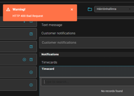

# Comments regarding the New Agent UI

**Källa:** https://community.efecte.com/t/y4y6cgw/comments-regarding-the-new-agent-ui
**Publicerad:** 2024-05-10T07:58:50.333Z
**Uppdaterad:** 2024-05-10T09:58:50.333000
**Författare:** 

---

Comments regarding the New Agent UI

      
    
          
      

        
              Jukka Jokinen
            

            
              Jukka_Jokinen
            1 yr agoFri, May 10, 2024 at 9:58 AM GMT+2
  

          1reply
        Juha HänninenProduct Owner1 yr agoThu, May 16, 2024 at 2:24 PM GMT+2
  
        

        
    
Hi,
Some observations regarding the new UI, based on 15min ad hoc testing:

 Modifying report conditions is not possible?
 Transforming data card is not possible (in the old UI this can be done from the ‘More…’ button)?
 Overall, if there is some custom logic built for an attribute, it may not work properly with the new UI. For instance, we have a push button in use in many templates, that is used for opening an hour reporting form (based on a separate template). This is not working with the new UI, it only shows a list of existing hour cards, i.e. creating a new hour report is not possible.
 For some older data cards it does not do even that, but shows a warning ‘HTTP 400 Bad request’ instead:

 For some older data cards, trying to link a CI to the data card is not working, it shows the same warning than above.
 In one template we have two check boxes with choices YES and NO, and a logic implemented to ensure that it is not possible to select both YES and NO, only either YES or NO. This is not working in the new UI. (And if both are selected, then saving the data card causes that both selections are cleared.)

These were tested both with dark mode and default theme, and same problems were identified with both. And with more thorough testing probably more problems can be found.
There are also some shortcomings relating to overall usability. For instance, it is not any more possible to open a single Class for editing, as the whole data card is always opened for editing. This makes it very cumbersome to edit data cards having a big number of classes…
Based on this, I’m sorry to say but I think you should reconsider your plan to provide access to the new UI by default starting in 2024.2 release. IMHO, this is not mature enough yet, and would cause plenty of problems to the users.
          
  Like
  Follow
    
            1

## Bilder

