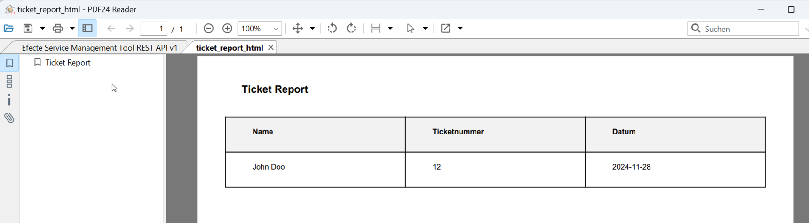

# How to Create PDFs?

**Källa:** https://community.efecte.com/t/p8yly7w/how-to-create-pdfs
**Publicerad:** 2024-12-16T13:57:38.877Z
**Uppdaterad:** 2024-12-16T16:31:14.533000
**Författare:** 

---

How to Create PDFs?

      
    
          
      

        
              Claus Weinholdt
            

            
              Claus_Weinholdt
            updated 1 yr agoMon, December 16, 2024 at 4:31 PM GMT+1
  

          2replies
        Tero Matinlassi1 yr agoTue, December 17, 2024 at 9:55 AM GMT+1
  
        

        
    

      
          

    
        
        
        
      

    

  Hello everyone,
I’m currently exploring how to create a PDF from entries in efecte. I have a few questions and would appreciate any guidance or best practices:

 How can I generate a PDF from an entry in efecte? Are there specific tools or configurations within efecte that allow this functionality?
 Where can the PDF be stored? Is it possible to save the PDF directly within efecte, or would it need to be exported to an external storage system (e.g., SharePoint, local drive, etc.)?
 Can the PDF be sent directly via email? If so, what is the process for attaching the generated PDF to an email and sending it to relevant recipients directly from efecte?
 Can this be achieved through scripting with Python 2? Specifically, can a PDF be generated from HTML code? If efecte supports scripting for this purpose, are there any examples, libraries, or documentation available to help create PDFs from HTML templates programmatically?

I’d love to hear how others have tackled similar requirements. Any detailed steps, insights, or examples would be appreciated!
Thanks in advance for your help 🙂🙂🙂
Best regards,
Claus
          
    
        Workflow
      
    
        Administration
      
    
  
  Like
  Follow

## Bilder

