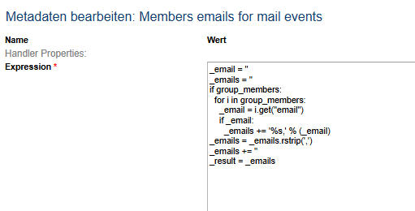

# Mail to Team via Workflow

**Källa:** https://community.efecte.com/t/y4yk4yg/mail-to-team-via-workflow
**Publicerad:** 2025-07-31T07:14:50.933Z
**Uppdaterad:** 2025-07-31T09:14:50.933000
**Författare:** 

---

Mail to Team via Workflow

      
    
          
      

        
              Julian
            

            
              Julian
            5 mths agoThu, July 31, 2025 at 9:14 AM GMT+2
  

          1reply
        Peter Scheffczyk1 mth agoMon, December 1, 2025 at 10:05 AM GMT+1
  
        

        
    
Hey all,
i'm trying to send mails to Team Members in Workflows. To address them in mail events i can use expression:  

 But this doesn't work for Workflows. I don't want to create a distributiongroup in our mail server for every team.
          
    
        Workflow
      
    
  
  Like
  Follow

## Bilder

