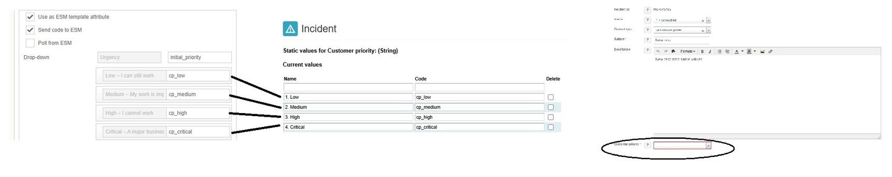

# Mapping dropdown selection in ESS to ESM

**Källa:** https://community.efecte.com/t/m1ylazg/mapping-dropdown-selection-in-ess-to-esm
**Publicerad:** 2025-02-17T07:27:20.053Z
**Uppdaterad:** 2025-02-17T08:27:20.053000
**Författare:** 

---

Mapping dropdown selection in ESS to ESM

      
    
          
      

        
              Luis Martínez
            

            
              Luis_Martinez
            11 mths agoMon, February 17, 2025 at 8:27 AM GMT+1
  

          

        
    
Hi, 
I'm trying to map the selection of a dropdown menu in ESS to a static value attribute in ESM but, for some reason, is coming empty.
Does anyone know what I'm doing wrong?

Thanks
Luis
          
  Like
  Follow

## Bilder

