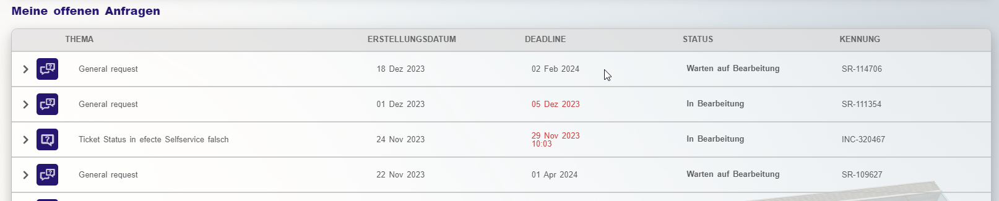
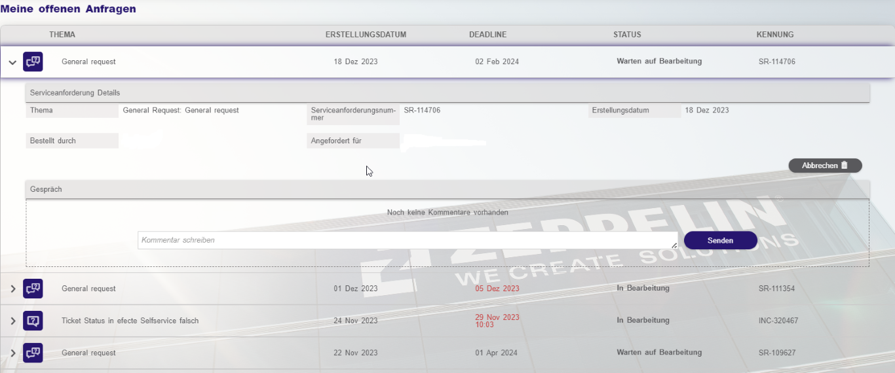

# Subject display for service requests

**Källa:** https://community.efecte.com/t/83yxyfw/subject-display-for-service-requests
**Publicerad:** 2024-01-25T14:28:31.720Z
**Uppdaterad:** 2024-01-25T15:28:31.720000
**Författare:** 

---

Subject display for service requests

      
    
          
      

        
              Richard Rößler
            

            Senior IT-Consultant
              Richard_Roessler
            1 yr agoThu, January 25, 2024 at 3:28 PM GMT+1
  

          2replies
        Per Bölte1 yr agoFri, February 2, 2024 at 2:58 PM GMT+1
  
        

        
    
Hello everyone,
We want to make self service a little more attractive for our users, but there's one detail that scares a lot of people and they can't do anything about it. When a request is created manually in the ESM, it is always displayed as a "general request" in the ESS. You only see the description when you expand it. Is there any way to get the subject to show up there too, like with incidents? My boss really wants a proper view.
          
    
        Self-Service Portal
      
    
        IT Service Management
      
    
  
  Like
  Follow
    
            1

## Bilder

