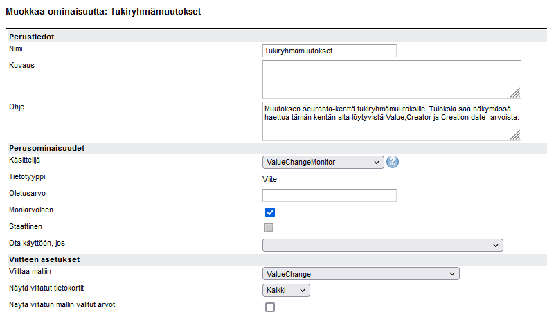
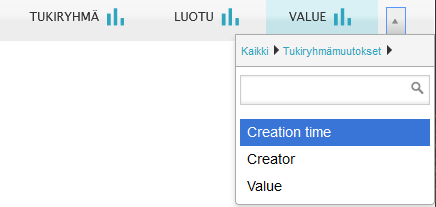

# ValueChange -model visibility to normal user

**Källa:** https://community.efecte.com/t/x2y8h1f/valuechange-model-visibility-to-normal-user
**Publicerad:** 2024-02-29T07:35:07.457Z
**Uppdaterad:** 2024-02-29T08:35:07.457000
**Författare:** 

---

ValueChange -model visibility to normal user

      
    
          
      

        
              Juho Romppanen
            

            
              Juho_Romppanen
            1 yr agoThu, February 29, 2024 at 8:35 AM GMT+1
  

          

        
    
Hello
 
In list view it seems that normal, not Efecte admin does not see inside of "ValueChange" model, and this not editable limit. Would it be possible to change this setting by Efecte admin?
 
Case scenario: incidents have log for support group changes through "ValueChangeMonitor". Changes are listed in list view, when Efecte admin checks status, but same data is not shown, when normal user checks support group changes Value/Creator/Creation time in list view. When one incident is opened, same data is shown to norma user also.

 

          
  Like
  Follow

## Bilder

