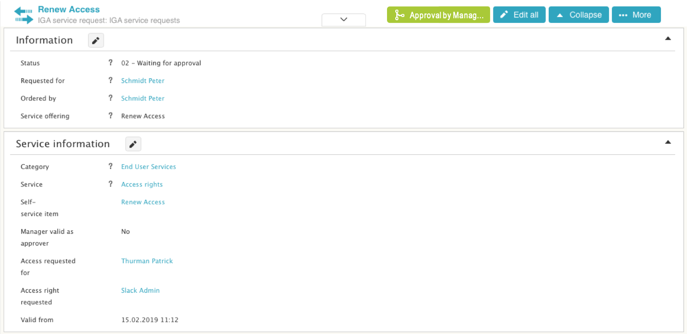

# Display workflow status on workspace

**Källa:** https://community.efecte.com/t/18sdwf/display-workflow-status-on-workspace
**Publicerad:** 2019-05-08T12:12:58.343Z
**Uppdaterad:** 2019-05-09T06:56:11.150000
**Författare:** 

---

Display workflow status on workspace

      
    
          
      

        
              Aki Koivukoski
            

            R&D
              Aki_Koivukoski
            updated 6 yrs agoThu, May 9, 2019 at 6:56 AM GMT+2
  

          7replies
        Peter ScheffczykEfecte Employee6 yrs agoTue, December 17, 2019 at 9:52 AM GMT+1
  
         Done
        

        
    

      
          

    
        
        
        
      

    

   As a user I want to be able to see which is the currently executed workflow node in the detail data card view  in order to understand where in the process the issue is.  
 AC:  
 
 Workspace UI shows the name of the current workflow node instead  of the "Running" text in the workflow status element  in detail data card view mode and detail data card edit mode 
 the workflow status indicator must resize based on the length of the text length of the workflow node name 
 the workflow status indicator must truncate the workflow node name with three dots when the workflow status indicator is too close to the collapse/expand button 
 the workflow status indicator must allow to cancel the workflow by clicking on it if the user has edit rights (current functionality) 

          
    
        Service Management Tool
      
    
  
  Vote
  Follow
    
            11

## Bilder

