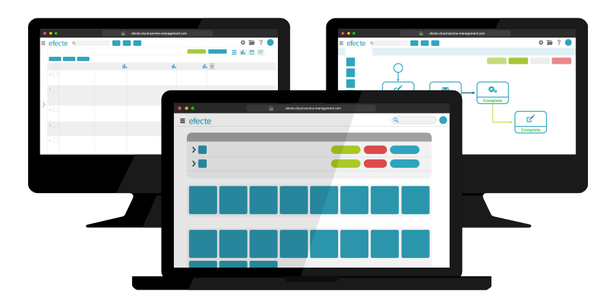

# Key Features from Efecte 2020.2

**Källa:** https://community.efecte.com/t/60h80c7/key-features-from-efecte-2020-2
**Publicerad:** 2020-09-01T10:58:06.507Z
**Uppdaterad:** 2020-09-01T12:59:16.193000
**Författare:** 

---

Key Features from Efecte 2020.2

      
    
          
      

        
              Patrick Thurman
            

            Product Manager
              Patrick_Thurman
            updated 5 yrs agoTue, September 1, 2020 at 12:59 PM GMT+2
  

          
        

        
    

      
          

    
        
        
        
      

    

  ContentsService Management ToolEfecte Provisioning EngineSelf-Service PortalDon't miss a release highlight The 2020.2 release of the Efecte Platform is now available for all customers. The new functionalities of this release are aimed at helping customers improve end-to-end experiences. Included in addition to the listed features are further developments aimed at increasing performance and quality.  
Service Management Tool 
 UI Refresh - Page Header: The first stage of our workspace UI refresh is the standardization and expansion of features to the header. With this release, all of the page headers will appear consistent across all pages. Other key improvements included with the header refresh are:  
 
 Up to five configurable “Create-New” buttons to create new datacards with a single click 
 A consistent page header for the compact and normal layout 
 The profile icon will display the users’ initials 
 
 Meaningful Web Page Titles: To meet Web Content Accessibility Guidelines (WCAG) 2.1 and improve user experiences, page titles will now display meaningful titles. The titles will be dependent on the view’s name or the data card’s primary attribute making it easier to find the required open browser tab or the browser bookmark.  
 Transporting Views Between Environments: Views can now be transported between multiple Efecte environments allowing administrators to build views in test environments and safely import them to the production environment. With this new feature, admins can export and import any graphic, list, or calendar view.  
 Edit Missing Fields When Moving Kanban Cards: Users will now be able to easily fill any mandatory fields when moving data cards within a kanban board.  
Efecte Provisioning Engine 
 Azure AD Improvements and Developments  
 
 Create New Users: Administrators will now be able to use the orchestration node to create new users within Azure AD.  
 Update User Information: Administrators will now be able to use event-based provisioning to update user information within Azure AD. Updating passwords will be handled through a separate orchestration activity. 
 Verify Users: The Efecte Provisioning Engine can verify if a user already exists in Azure AD using event-based provisioning. 
 Add/Remove Users To/From Group(s): The orchestration workflow node can now be used to add or remove users to or from AD groups within Azure AD. When users are added or removed from a group any associated access rights will be updated per the change. 
 
 Reset AD and Azure AD Passwords with Workflow Nodes: Administrators can now use the orchestration workflow node to reset passwords in the AD and Azure AD.  
Self-Service Portal 
 Front Page UI Enhancements: To improve user experiences and modernize our self-service portal we have made minor changes aimed at improving the design. These include:  
 
 Modernization of the approvals, requests, and announcements UI 
 Refresh of the “service offering” look and feel 
 
Don't miss a release highlight 
 Subscribe to our Product news mailing list to receive an email notification when we make a new post! 
          
    
        EPE
      
    
        Self-Service Portal
      
    
        Service Management Tool
      
    
  
  Vote
  Follow

## Bilder

