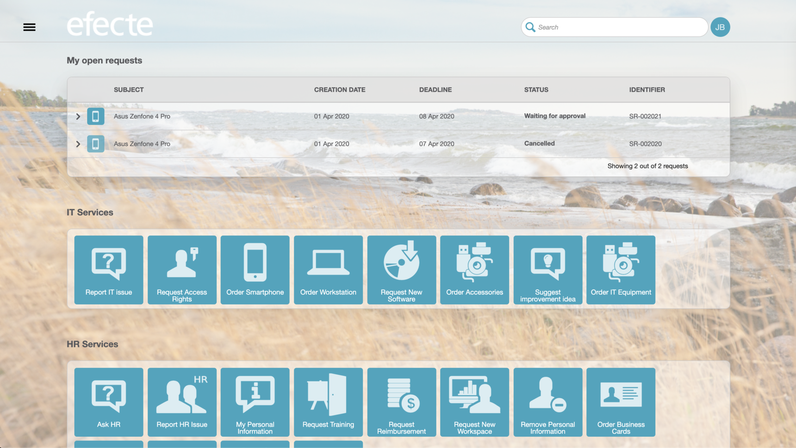

# Self-Service Portal Front Page UI Enhancements

**Källa:** https://community.efecte.com/t/p8hyqjz/self-service-portal-front-page-ui-enhancements
**Publicerad:** 2020-04-01T12:37:00.363Z
**Uppdaterad:** 2020-04-01T14:37:00.363000
**Författare:** 

---

Self-Service Portal Front Page UI Enhancements

      
    
          
      

        
              Aki YlivarviModerator
            

            
              Aki_Ylivarvi
            5 yrs agoWed, April 1, 2020 at 2:37 PM GMT+2
  

          1reply
        Peter Schneider5 yrs agoWed, May 27, 2020 at 12:44 PM GMT+2
  
         Done
        

        
    

      
          

    
        
        
        
      

    

  ContentsDescriptionAcceptance criteriaDescription 
 New front page design modernises the Self-Service portal end user experience.  
Acceptance criteria 
 
 remove the vertical lines from the Waiting for approval, My open requests and Announcement -tables 
 the containers stacking the Service Offering icons shall be partly transparent 
 the tables Waiting for approval, My open requests and Announcement shall be partly transparent 
 remove the "Show all" -button from the My open requests -table and replace it with the "more" -text link 

          
    
        Self-Service Portal
      
    
  
  Vote
  Follow
    
            1

## Bilder

