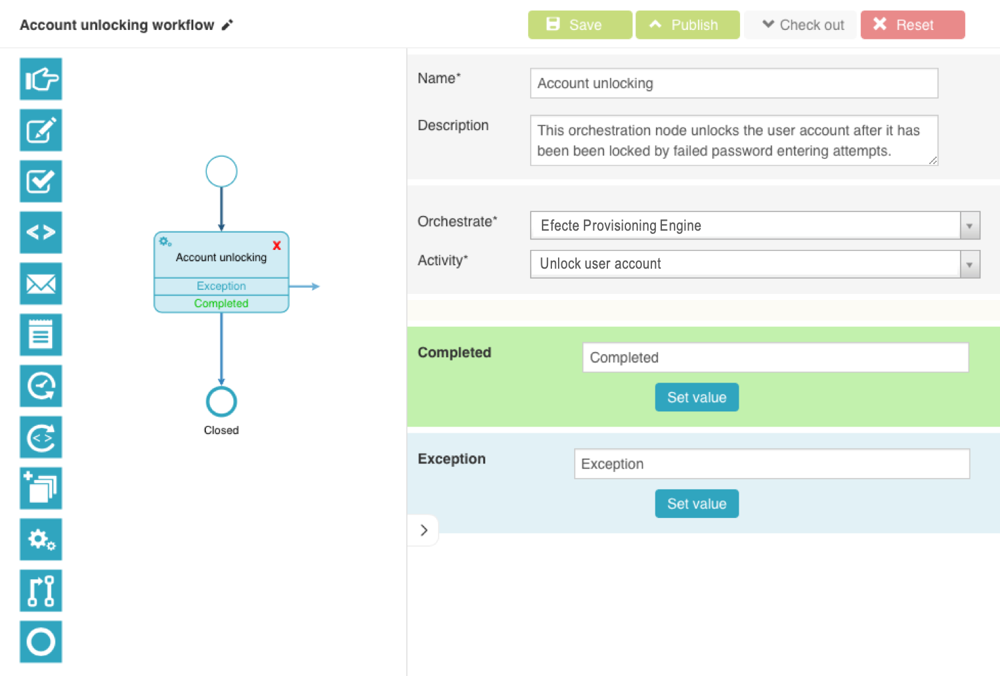

# EPE: Possibility to unlock user account by orchestration node

**Källa:** https://community.efecte.com/t/k9sd7b/epe-possibility-to-unlock-user-account-by-orchestration-node
**Publicerad:** 2019-05-08T13:11:18.007Z
**Uppdaterad:** 2020-08-07T06:55:23.423000
**Författare:** 

---

EPE: Possibility to unlock user account by orchestration node

      
    
          
      

        
              Jukka PapinahoEfecte Employee
            

            
              Jukka_Papinaho
            updated 5 yrs agoFri, August 7, 2020 at 6:55 AM GMT+2
  

          2replies
        Jukka PapinahoEfecte Employee5 yrs agoFri, February 28, 2020 at 11:16 AM GMT+1
  
         Done
        

        
    

      
          

    
        
        
        
      

    

   As a service management tool user I want to have an orchestration node to unlock a user account in order to both manually as well automatically unlock an account in the AD which has been locked by failed password attempts.  
  
 ACs:  
 
 the administrator must be able to add  an activity "Unlock user account" for the "Efecte Provisioning Engine" in the orchestration node of the visual workflow automation 
 the service management tool must be able to instruct the AD to unlock an account 
 
 Note:  
 
 the functionality can be triggered from the Workspace UI in the service management tool by a support person with the click of a button in the person data card 
 the functionality can be triggered from the self-service portal 

          
    
        Service Management Tool
      
    
        IGA
      
    
        EPE
      
    
  
  Vote
  Follow
    
            3

## Bilder

