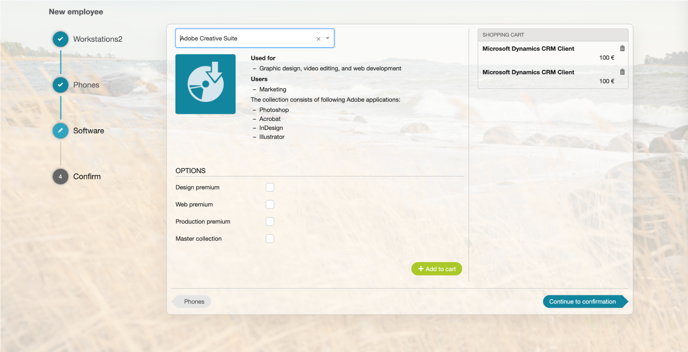

# ESS: UI Refresh Self-Service Portal: Progress Indicator

**Källa:** https://community.efecte.com/t/x2hxgxm/ess-ui-refresh-self-service-portal-progress-indicator
**Publicerad:** 2020-07-01T10:52:18.333Z
**Uppdaterad:** 2020-08-07T06:52:25.337000
**Författare:** 

---

ESS: UI Refresh Self-Service Portal: Progress Indicator

      
    
          
      

        
              Peter Schneider
            

            Chief Evangelist / Storyteller
              Peter_Schneider
            updated 5 yrs agoFri, August 7, 2020 at 6:52 AM GMT+2
  

           Done
        

        
    

      
          

    
        
        
        
      

    

   User Story:  
 As a user, I want to see progress in service bundles to the next step as String of Perls as modern execution of workflows.  
  
 ACs:  
 
 if there is an ongoing bundle order, the phase of the order shall be visualized with a progress cycle on mobile devices 
 if there is an ongoing bundle order, the phase of the order shall be on the left-hand side of the order procedure and shown as a string of pearls (including text) on desktop devices 

          
    
        Self-Service Portal
      
    
  
  Vote
  Follow
    
            2

## Bilder

