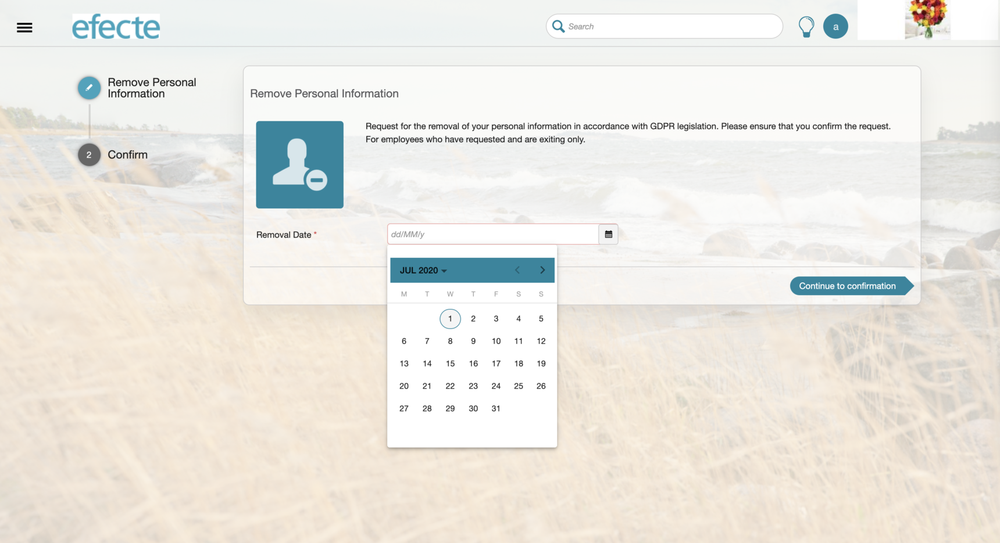

# ESS: UI Refresh Self-Service Portal - Service Item Page

**Källa:** https://community.efecte.com/t/83hxgxj/ess-ui-refresh-self-service-portal-service-item-page
**Publicerad:** 2020-07-01T10:56:13.090Z
**Uppdaterad:** 2020-08-07T06:52:08.807000
**Författare:** 

---

ESS: UI Refresh Self-Service Portal - Service Item Page

      
    
          
      

        
              Peter Schneider
            

            Chief Evangelist / Storyteller
              Peter_Schneider
            updated 5 yrs agoFri, August 7, 2020 at 6:52 AM GMT+2
  

           Done
        

        
    

      
          

    
        
        
        
      

    

  ContentsStory:AC:Story: 
 As a user, I want to use a modern portal user interface when selecting a service item.  
AC: 
 
 the service item page width shall be the same as front page width is for service categories 
 the services icons shall be aligned to left with few pixel separations 
 the arrow icon on the mobile layout shall be working with finger "swipe" move to show more icons 
 introduce the facelift to calendar picking 
 introduce the facelift to multi-value picking 

          
    
        Self-Service Portal
      
    
  
  Vote
  Follow
    
            2

## Bilder

