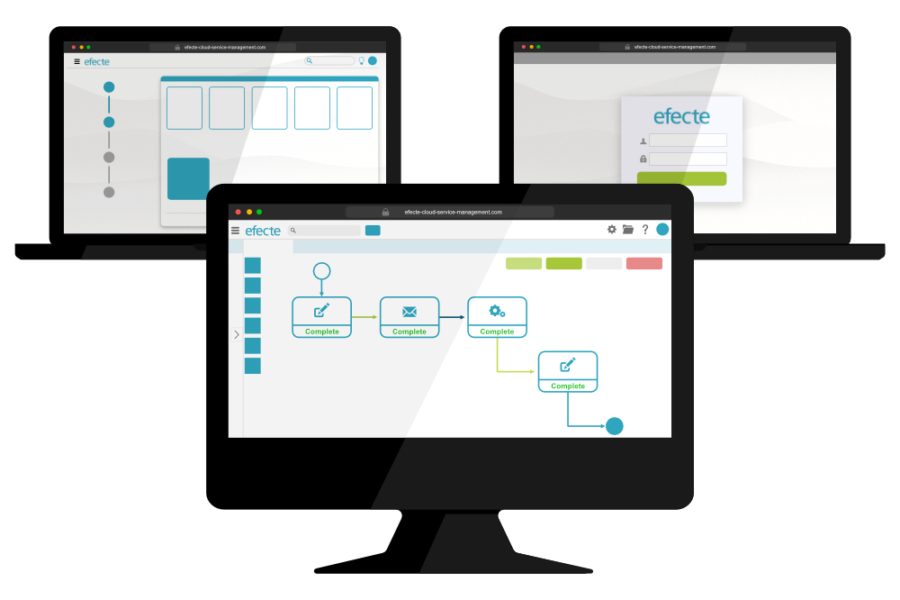

# Key Features from Efecte 2020.3

**Källa:** https://community.efecte.com/t/60h6c18/key-features-from-efecte-2020-3
**Publicerad:** 2020-10-22T12:46:44.060Z
**Uppdaterad:** 2020-11-10T12:48:05.170000
**Författare:** 

---

Key Features from Efecte 2020.3

      
    
          
      

        
              Patrick Thurman
            

            Product Manager
              Patrick_Thurman
            updated 5 yrs agoTue, November 10, 2020 at 12:48 PM GMT+1
  

          
        

        
    

      
          

    
        
        
        
      

    

  ContentsIdentity and Access Management CapabilitiesSelf-Service CapabilitiesEfecte Identity ManagementDon't miss a release highlight The 2020.3 release of the Efecte Platform is now available for all customers. The new functionalities of this release are designed to automate even more access and identity-related activities. Included in addition to the listed features are further developments aimed at increasing performance and quality.  
Identity and Access Management Capabilities 
 Efecte Visual Workflow Orchestration Node Enhancements:  
 
   Deleting users from AD/ Azure AD: Administrators can use the orchestration node within our Visual Workflow engine to delete users based on events. Events can be created directly from the Service Management Tool, our Self-Service Portal, or an integrated system.   
   Unlock user accounts: Administrators can now use the orchestration node to automatically or manually unlock user accounts locked due to multiple wrong password attempts. Service Management Tool users can unlock accounts from the workspace UI, or the event can be created from a self-service offering or an integrated system.   
 Execute schedule based provisioning with different technical users: Managed Service Providers (MSP's) can now allow their customers to execute scheduled provisioning tasks using the Efecte's WebAPI. This will help to increase clarity and security for MSP's through better controls and reporting.  
 
 Please note that all the above-described functionality is supported when using the Efecte Provisioning Engine.  
Self-Service Capabilities 
 UI Enhancements: To improve user experiences and modernize the self-service portal we have made minor changes aimed at improving the design. These include:  
 
   Bundle progress indicator: Bundled services (such as on-boarding) now have a new String of Pearls indicator on the left of the window to allow users to easily follow their progress of the service.   
   Service item page: The service offering page will now use the full width to display information. Also included in this enhancement are updates to the design of the calendar and the multi-value pickers fields.   
   Expanded confirmation dialog (desktops): When confirming a new request created on a desktop device the details of the order will be open by default. Due to space constraints, this change will not affect mobile users.   
 
Efecte Identity Management 
 Greater support for DFN-AAI: We have implanted changes related to SAML authentication in order to better support German National Research and Education Network Authentication and authorization infrastructure (DFN-AAI).  
Don't miss a release highlight 
 Subscribe to our Product news mailing list to receive an email notification when we make a new post! 
          
    
        EPE
      
    
        Self-Service Portal
      
    
        Service Management Tool
      
    
        Identity Management
      
    
  
  Vote
  Follow

## Bilder

