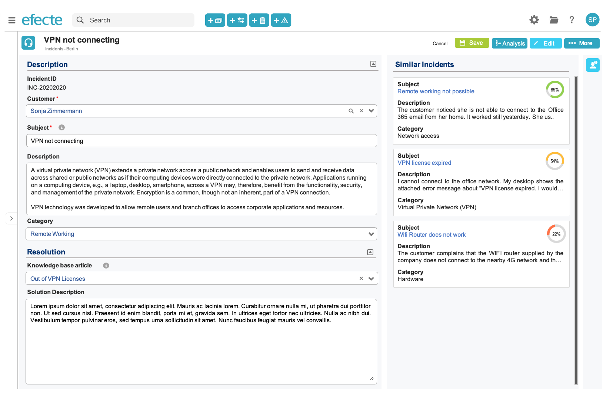

# ESM: AI-Powered Similar Issue Suggestions

**Källa:** https://community.efecte.com/t/60h6gxg/esm-ai-powered-similar-issue-suggestions
**Publicerad:** 2020-10-02T07:21:22.933Z
**Uppdaterad:** 2020-11-10T12:47:37.607000
**Författare:** 

---

ESM: AI-Powered Similar Issue Suggestions

      
    
          
      

        
              Peter Schneider
            

            Chief Evangelist / Storyteller
              Peter_Schneider
            updated 5 yrs agoTue, November 10, 2020 at 12:47 PM GMT+1
  

          1reply
        Peter Schneider5 yrs agoMon, November 9, 2020 at 1:41 PM GMT+1
  
         Done
        

        
    

      
          

    
        
        
        
      

    

  ContentsUser StoryAcceptance CriteriaUser Story 
 As a service desk agent,  
 I want to  understand which similar issues exist related to the issue I'm working on   
 because it will help me to focus on strategic initiatives while speeding up the recording and resolving of issues.  
 NOTE: This is a licensable feature due to the additional hardware and operational requirements for the Artificial Intelligence  Component in a dedicated Docker container. Please contact your Efecte sales representative to inquire about information on the activation of this capability.  
 NOTE2: Activation of this capability requires curated historic issues data of at least 10.000 records and training of the model which requires a professional service from an Efecte consultant.  
 Note3: All data necessary for this functionality will stay in the Efecte cloud environment in the AIC container with the current production cloud. No external service is used in the deployment.  
 Note4: Currently, one language can be supported for each issue (template) including initially Finnish, English, or German. For more languages, please discuss this with your Efecte contact.  
Acceptance Criteria 
 
 The user must be able to choose to see Similar Issues in the Detail Datacard UI, 
   
   The user profile setting includes a configuration to activate the Similar Issues feature 
    
 The Similar Issues are shown on the right-hand side (the so-called Supplementary Information Area) of the data card view in edit mode when clicking on the Similar Issue Suggestions button 
   
   the Similar Issues content is displayed in the so-called Supplementary Information Area (Note: This area will also be used to show the Activity Feed and the Referrers in the future) 
   The Similar Issue Suggestions button uses a Glyphicon icon 
   The Similar Issues Suggestions button shall be displayed in a light color when the Supplementary Information Area is expanded 
   The Supplementary Information Area is collapsed when clicking on the Similar Issue Suggestions button again 
    
 ESM requests from the Artificial Intelligence Component (AIC) which similar issues exist in the trained model for the current issue based on the attributes configured in the platform settings 
   
   a support agent opens an issue such as an incident in edit mode 
   the service management tool sends a request to the Artificial Intelligence Component (AIC) for related content when the subject ( a short description) of the issue has been recorded 
   the AIC analyses the intent of the subject and other selected attributes and returns related content from the same template that has been modeled and trained in the AIC component the service management tool displays the results with a confidence rating  
   the support agent can check the details of the similar issues from the reference in a new window and copy/paste any relevant information to the open template 
    
 An Efecte consultant can modify the re-training frequency and templates to be trained in the AIC.  
 The results for Similar Issue datacards are presented in the Supplementary Information Area 
   
   The title for the Similar Issues shall be by default "Related <template name>" 
   The main attribute of the Similar Issue Suggestions must be a reference marked in blue font that can be opened by clicking on it 
   The title for the Similar Issues can be localized in the localization table 
   The confidence results are displayed in the following colors: c8d94a, ffbc3a, ff7247 
    

          
    
        IT Service Management
      
    
  
  Vote
  Follow
    
            9

## Bilder

