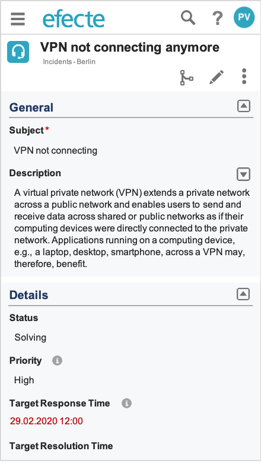
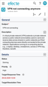
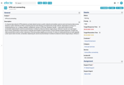

# ESM: Detail View UI Refresh - Normal Layout - View Mode

**Källa:** https://community.efecte.com/t/y4hqjfj/esm-detail-view-ui-refresh-normal-layout-view-mode
**Publicerad:** 2020-02-04T09:11:19.607Z
**Uppdaterad:** 2020-08-07T06:58:16.690000
**Författare:** 

---

ESM: Detail View UI Refresh - Normal Layout - View Mode

      
    
          
      

        
              Peter Schneider
            

            Chief Evangelist / Storyteller
              Peter_Schneider
            updated 5 yrs agoFri, August 7, 2020 at 6:58 AM GMT+2
  

          3replies
        Peter Schneider5 yrs agoMon, November 9, 2020 at 1:43 PM GMT+1
  
         Done
        

        
    

      
          

    
        
        
        
      

     
          
          

  

  ContentsUser story:AC's:User story: 
 As a user of Efecte's Service Management Tool (ESM) a user wants to enjoy a modern user interface in order to work not only effectively but also with delight.  
AC's: 
 Usability:  
 
 the Normal Layout of the Detail View shall comply to the WCAG2.1 guidelines (AA level) 
   
   keyboard shortcuts shall work as Efecte 2020.2 release 
   the cursor highlight shall be placed in the first attribute in the first class 
   keyboard tabs shall move the cursor from one attribute to the next visible one 
   contrasts shall comply with AA level of WCAG2.1 i.e be 4,5:1 or higher 
   mandatory fields shall be marked with a "*" sign in red color 
   font size shall comply with the WCAG2.1 guidelines (AA level) 
   assistive screen reader tools shall be supported: 
     
     HTML elements have complete start ( < > ) and end ( </ > ) tags where needed. 
     Nest all HTML elements correctly (for example, list objects within an ordered or unordered list) 
     Use unique Ids 
     HTML elements don’t contain duplicate attributes 
     Mark headings with HTML header tags 
     Use clear labels and alternative text on forms 
     Use CSS to style headings 
     Use CSS to style navigation menus as text 
      
   error identification: clear and easy-to-understand error texts that can be localized shall be displayed when the user makes an error such as leaving a mandatory field empty or violating a validator condition; the error message shall include an explanation how to avoid the error 
   each page of the Detail View has the language of the presentation text assigned to it 
   tooltips are shown for all interaction elements 
    
 
  Technology:  
 
 the Normal Layout of the Detail View shall be programmed with the Angular 8 or newer UI framework 
 
 Layout:  
 
 the existing template layout editor can be used to set up the layout of the Detail View 
 the existing class layout options must be supported (one column, two columns, three columns) 
 one new class layout options shall be supported: two-third/one third 
 
 Interoperability and Responsive UI  
 
 the latest versions of Google Chrome, Firefox Mozilla, Apple's Safari and Microsoft Edge browsers must be supported on desktop devices 
 the latest versions of Google Chrome, Firefox Mozilla, and Apple's Safari browsers must be supported on mobile devices powered by Android OS and iOS 
 the layout must always adjust to the width of the display of mobile devices (Note: two-column layout must be supported on tablet-sized devices powered by Android and iOS) 
 
 Detail View Title Bar  
 
 the title bar must display the value of the primary attribute 
 the title bar must display the template icon 
 the title bar must display the folder of the data card 
 the title bar must display the Visual Workflow status 
 the title bar must allow activating editing of all classes 
 the title bar must allow collapsing/expanding of all classes 
 the title bar must allow selecting more data card actions from the More Menu 
 the interaction buttons on the title bar shall be placed below the value of the primary attribute on mobile devices 
 presentation texts must be localized according to the user's profile preferences 
 the color of the buttons must adhere to button customization capability 
 it shall be possible to create a new data card of the same template from the More menu (especially valuable in mobile devices), interaction shall be shown depending on permissions of the user it shall be possible to delete the currently shown card from the More menu, interaction shall be shown depending on the user permission 
 
 Detail Content Area  
 
 the background color is the blue color of the Finnish flag in 97% transparency (hexadecimal code is 002F6C) 
 the class names shall be displayed in larger, bold font in dark blue 
 the content of all classes must be shown according to the template layout editor 
   
   all content of all classes can be expanded or collapsed with the button in the title bar 
   a single class can be expanded or collapsed using by clicking on the dedicated icon beside the class name 
     
     tooltip is supported 
      
    
 the attribute name is displayed in bold font a dedicated row 
 the help text icon is displayed in the same row of the attribute name 
 the attribute value is shown below the attribute name 
 attribute names can be wrapped if necessary (comment: unlikely but supported for backward compatibility) 
 class and attribute names must support multi-language configuration support 
 double-clicking/double-tapping on a particular value of an attribute activates the edit mode of all attributes in the class if the user has update permissions for the particular attribute 
   
   a pop-up message is displayed when the user has no update permission to the particular attribute: "Sorry! You don't have permission to edit this field. Please contact your administrator if you need a change of permissions." 
    
 the value of string attributes shall be displayed on the full width of the column 
 date, date&time, number, and decimal number values shall be displayed on the left-hand side of the column 
 text attribute values shall be shown in a field with configurable text height 
   
   text attributes must have a new data defining the height of the text box by the number of rows 
   the default value is 7 rows 
    
 reference values shall be shown in blue font color 
   
   hovering over reference values shall display the values selected for the corresponding reference template 
    
 
 NOTE: Email, tables, work logs, text notes, and other major UI elements are handled in dedicated stories. 
          
    
        Service Management Tool
      
    
  
  Vote
  Follow
    
            6

## Bilder

