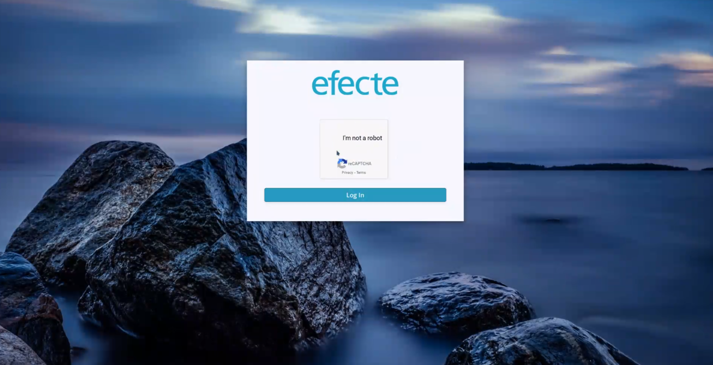

# ESS: Guest Access

**Källa:** https://community.efecte.com/t/83h68az/ess-guest-access
**Publicerad:** 2020-09-18T11:51:52.637Z
**Uppdaterad:** 2020-09-21T08:10:28.620000
**Författare:** 

---

ESS: Guest Access

      
    
          
      

        
              Jukka PapinahoEfecte Employee
            

            
              Jukka_Papinaho
            updated 5 yrs agoMon, September 21, 2020 at 8:10 AM GMT+2
  

          1reply
        Peter Schneider5 yrs agoMon, November 2, 2020 at 12:14 PM GMT+1
  
         Done
        

        
    

      
          

    
        
        
        
      

    

   Story: As a user without information in the Active Directory I want to have access to the self-service portal without self-registration.  
 ACs:  
 
 Users shall be instantly re-directed to ESS  front page without going through the authentication once they have entered the corresponding URL 
   
   After the user clicks the link or types the URL to the browser the ReCaptcha screen is shown for the user 
   after ReCaptcha is resolved, the user shall be re-directed to ESS front page (customer's Google account is required to enabling this functionality) 
    
 When a customer is using guest access functionality, they should have two self-service tenants due to security reasons: one for normal self-service to known users and one for unknown users 
 For limiting the front page functions to unregistered users, a new role (name: Public) shall be introduced 
 The following ESS UI components shall not be visible to unregistered users (role: Public): 
   
   Left-hand navigation panel 
   Approvals 
   My requests 
   Our requests 
   My things 
   Main panel 
     
     Waiting for approval 
     My Open requests 
      
    
 
 NOTE: In order to benefit from the feature, customers must deploy the new authentication component Efecte Secure Access.  
 NOTE2: The additional self-service tenant is a licensable capability. 
          
    
        Self-Service Portal
      
    
  
  Vote
  Follow
    
            1

## Bilder

