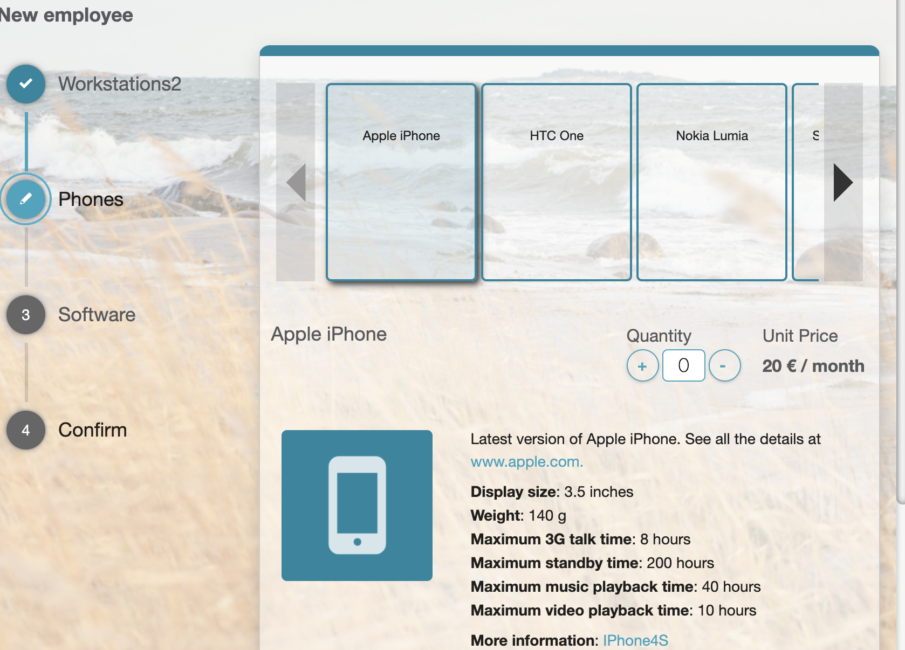

# ESS: Quantity Selection for Service Item

**Källa:** https://community.efecte.com/t/x2h8njs/ess-quantity-selection-for-service-item
**Publicerad:** 2020-08-27T05:35:40.480Z
**Uppdaterad:** 2020-08-27T07:37:43.697000
**Författare:** 

---

ESS: Quantity Selection for Service Item

      
    
          
      

        
              Aki YlivarviModerator
            

            
              Aki_Ylivarvi
            updated 5 yrs agoThu, August 27, 2020 at 7:37 AM GMT+2
  

          2replies
        Peter Schneider5 yrs agoMon, November 2, 2020 at 12:08 PM GMT+1
  
         Done
        

        
    

      
          

    
        
        
        
      

    

   User story:  
 As a Self-Service Portal user, I want to add more than one same product to single order.  
  
 AC's:  
 
 Adding a Quantity attribute to the service item administration UI (Single Item order) 
 Calculating and displaying a multiple of the price of a single service item in the confirmation dialog UI 
 Communicating the number of service items ordered (the multiplier) to the Service Management Tool 

          
    
        Self-Service Portal
      
    
  
  Vote
  Follow
    
            2

## Bilder

