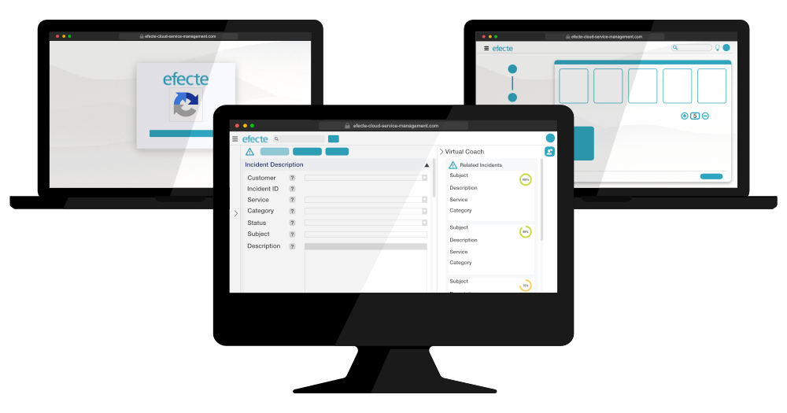

# Key Features from Efecte 2020.4

**Källa:** https://community.efecte.com/t/x2hm727/key-features-from-efecte-2020-4
**Publicerad:** 2020-12-01T07:09:45.137Z
**Uppdaterad:** 2020-12-01T08:11:18.170000
**Författare:** 

---

Key Features from Efecte 2020.4

      
    
          
      

        
              Patrick Thurman
            

            Product Manager
              Patrick_Thurman
            updated 5 yrs agoTue, December 1, 2020 at 8:11 AM GMT+1
  

          
        

        
    

      
          

    
        
        
        
      

    

  ContentsService Management CapabilitiesIdentity and Access Management CapabilitiesSelf-Service CapabilitiesNew User Interface for Community FeedbackNew User Interface for Community Feedback The 2020.4 release of Efecte is now available for all customers. The new functionalities of this release are aimed at helping customers improve their service management through AI, multi-language support, and UI improvements. Included in addition to the listed features are further developments aimed at increasing performance and quality.  
Service Management Capabilities 
 AI-Powered Virtual Coach: The Efecte Virtual Coach is an Artificial Intelligence solution enabling support agents to provide help faster to customers. The Virtual Coach provides suggestions from similar issues to support agents during the analysis using natural language processing (NLP) to help agents identify known solutions and duplicate issues. Click here to find out more about the Efecte Virtual Coach.  
 Multi-language support: To better serve multi-national organizations, we have now increased our platform’s multi-language functionalities. Admins will now easily manage translations of customer-specific configurations for field names and buttons using a new administration panel. In existing systems, all languages will use the system default language for any untranslated text.  
Identity and Access Management Capabilities 
 Guest Access: To enable new use cases on the Efecte platform, we have enabled the ability to grant guest access to Efecte’s Self-Service Portal. Guest users will have limited visibility of services and information. To improve security, the user will need to complete a ReCaptcha action. Users with guest access will use a separate cloud tenant from registered users.  
 Please note that the above-described functionality is supported when using the new Efecte Secure Access component (more information about the new platform component in the Efecte Community here).  
Self-Service Capabilities 
 Quantity Selector: Ordering multiples of a single item is now even simpler from Efecte’s Self-Service Portal. Users can create a single request with multiple, duplicate items within single item requests or shopping catalog orders. This feature works similarly to most consumer web-shop quantity selector.  
New User Interface for Community Feedback 
 This release also the beta version of the modernized user interface for viewing details of data cards in the Service Management Tool. While the scope of the implementation is not complete, Efecte wants to provide the current implementation to as many users as possible for feedback. Therefore, we have added the new user interface as a layout option, which users can activate from the profile settings.  
 The refreshed user interface supports the viewing of the majority of attributes in a new look and feel. More complex UI elements, for example, for email conversations and internal comments, as well the ability to edit data cards in the new UI, will be released in future releases. Efecte is looking forward to a rich dialog on the modernized user interface in the Efecte Community. In addition, feedback can be sent directly to ui.feedback@efecte.com. 
New User Interface for Community Feedback 
 Subscribe to our Product news mailing list to receive an email notification when we make a new post! 
          
    
        EPE
      
    
        ESA
      
    
        Self-Service Portal
      
    
        Service Management Tool
      
    
  
  Vote
  Follow
    
            2

## Bilder

