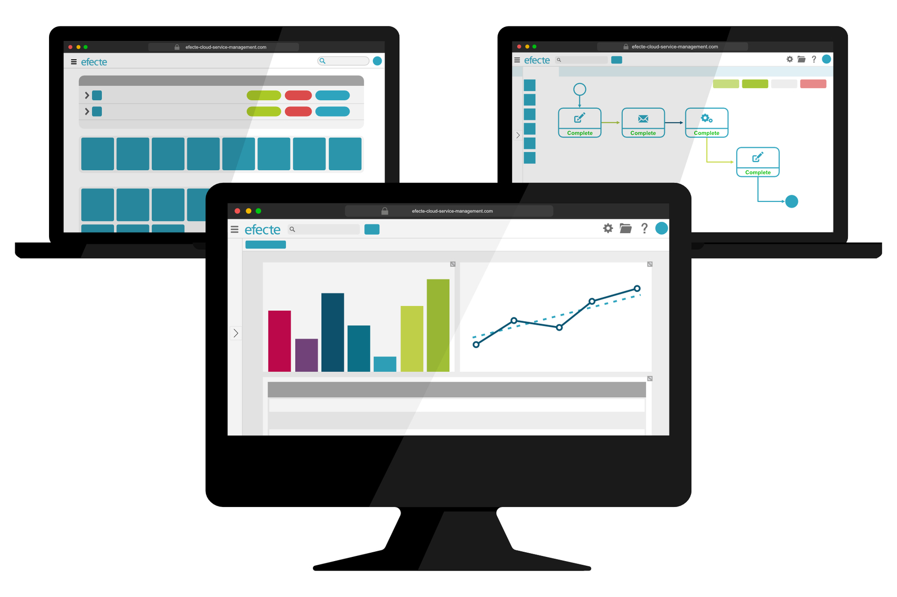

# Key Features of Efecte 2021.4

**Källa:** https://community.efecte.com/t/x2hjvtk/key-features-of-efecte-2021-4
**Publicerad:** 2022-01-10T13:58:17.527Z
**Uppdaterad:** 2022-01-10T14:58:17.527000
**Författare:** 

---

Key Features of Efecte 2021.4

      
    
          
      

        
              Patrick Thurman
            

            Product Manager
              Patrick_Thurman
            4 yrs agoMon, January 10, 2022 at 2:58 PM GMT+1
  

          
        

        
    

      
          

    
        
        
        
      

    

  ContentsKey Features from Efecte 2021.4Service Management CapabilitiesIdentity Governance & Administration CapabilitiesVirtual Coach (AI) Capabilities The 2021.4 release of Efecte is now available for all customers. This release's new functionalities aim to help customers boot the value of their service management and identity governance. Included in addition to the listed features are further developments aimed at increasing performance and quality.  
Key Features from Efecte 2021.4 
Service Management Capabilities 
 REST API: Efecte now offers a modern and easy-to-use integration API for third-party integrations with the widely utilized REST architecture style. REST will provide a logical way to access the ESM data structured by the data cards and templates.  
 This is a separately licensable feature. For more information, you can contact your account manager.  
Identity Governance & Administration Capabilities 
 Efecte IGA Starter: Efecte IGA Starter is a quick-to-deploy solution packed with essential use cases, reports & more pre-packaged for quick deployment. Click here to learn more about what is included in Efecte IGA Starter.  
 Support for event-based provisioning to IBM LDAP: Efecte’s Provisioning Engine (EPE) now supports scheduled- and event-based provisioning for IBM LDAP (IBM Directory Server).  
Virtual Coach (AI) Capabilities 
 Automatic Second Level Categorization (Part 1): This feature has been enabled in two phases. During the first phase, we have enabled the ReferenceCopy handler to fill fields based on the first level categorization or any other reference attribute. The second phase of this development is planned for 2022. 
          
    
        EPE
      
    
        Service Management Tool
      
    
        Virtual Coach
      
    
  
  Vote
  Follow

## Bilder

