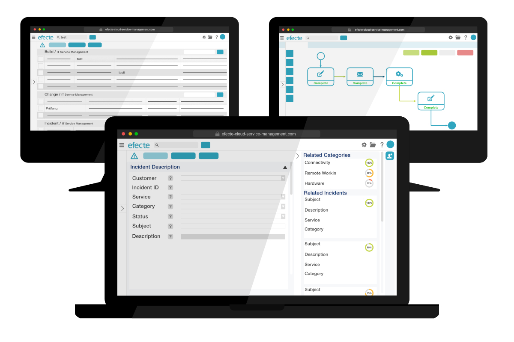

# Key Features from Efecte 2021.1

**Källa:** https://community.efecte.com/t/m1hzaba/key-features-from-efecte-2021-1
**Publicerad:** 2021-02-23T07:09:25.613Z
**Uppdaterad:** 2021-02-23T08:09:25.613000
**Författare:** 

---

Key Features from Efecte 2021.1

      
    
          
      

        
              Patrick Thurman
            

            Product Manager
              Patrick_Thurman
            4 yrs agoTue, February 23, 2021 at 8:09 AM GMT+1
  

          

        
    

      
          

    
        
        
        
      

    

  ContentsService Management CapabilitiesIdentity and Access Management Capabilities The 2021.1 release of Efecte is now available for all customers. This release's new functionalities aim to help customers improve their service management through AI, multi-language support, and IAM improvements. Included in addition to the listed features are further developments aimed at increasing performance and quality.  
Service Management Capabilities 
 AI-Powered Category Suggestions: The Efecte Virtual Coach is an Artificial Intelligence solution enabling support agents to provide help faster to customers. With this update, the Virtual Coach can now provide category suggestions to support agents along with similar issues. The category suggestions will include a confidence rating, and agents can instantly assign the category by selecting the correct suggestion. The Virtual Coach can be configured to use up to 3 attributes (i.e., subject, description, related assets) to provide suggestions.  
 Multi-language Support - Searching Static Values: Users will now be able to search static values using any language included within their Service Management Tool. This development will simplify searching by allowing system administrators and users to find relevant information using their preferred or local language. Bookmarks, search templates, and public views will be shown in the end-user's selected language.  
Identity and Access Management Capabilities 
 Group Provisioning Activities: The orchestration activity now allows for group verification and adding or removing users to or from a group. This enhancement and development will allow admins to identify if an activity fails, greatly improving visibility and audibility.  
 Please note that these improvements are with the Efecte Provisioning Engine (EPE) component.  
 REST API Improvements: Efecte Identity Management Rest API now supports the following features:  
 
 Changing passwords 
 User connection handling 
 Custom attributes (searching based on customer attributes is not supported) 
 Custom event triggering 
 
 Please note that these improvements are with the Efecte Identity Management (EIM) component. 
          
    
        Service Management Tool
      
    
        EPE
      
    
        ESA
      
    
        Identity Management
      
    
  
  Vote
  Follow
    
            1

## Bilder

