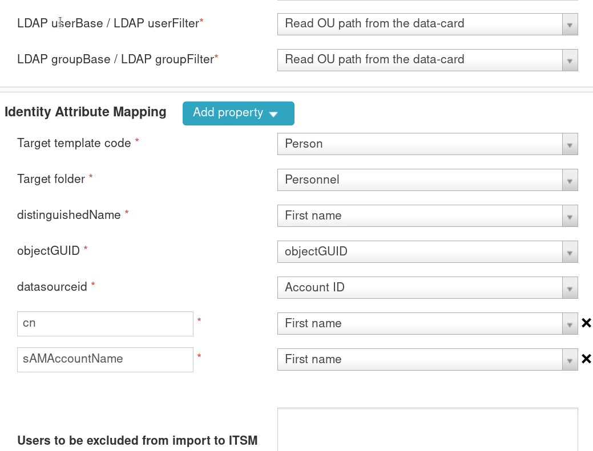
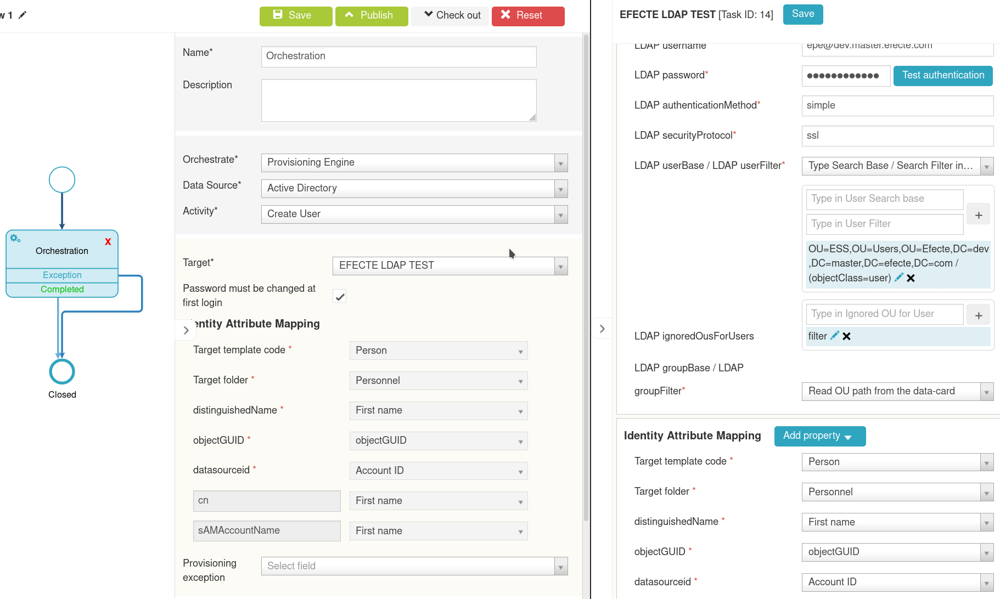

# Enhanced event-based provisioning task configuration

**Källa:** https://community.efecte.com/t/m1hld2y/enhanced-event-based-provisioning-task-configuration
**Publicerad:** 2021-03-31T09:18:04.967Z
**Uppdaterad:** 2021-03-31T11:18:04.967000
**Författare:** 

---

Enhanced event-based provisioning task configuration

      
    
          
      

        
              Jukka PapinahoEfecte Employee
            

            
              Jukka_Papinaho
            4 yrs agoWed, March 31, 2021 at 11:18 AM GMT+2
  

           Done
        

        
    
 Story:  
 As an Administrator, I want to have possibility to choose if information of the organization unit (OU-path) for example new user creation is defined in the provisioning task or is it read from the ESM datacard. This would decrease the amount of the needed event-based provisioning task.  There are cases, where customer are creating new users to several OU-paths and with this approach we would use one provisioning task and part of the needed information is read from datacard  
 ACs:    
 
 LDAP userBase / LDAP userFilter 
   
   has a options (dropdown menu) "Type userbase / userfilter in the box" or "Read OU-path from the datacard" 
   when administrator choose "Type userbase / userfilter in the box" 
     
     administrator must type needed information to the provisioning task configuration view 
      
   when administrator choose "Read OU-path from the datacard" 
     
     orchestration activities are able to read information from datacard 
      
    
 Orchestration activities can read Organization Unit- paths 
   
   from the provisioning tasks as like now if administrator select "Type userbase / userfilter in the box" 
   from the datacard if administrator select "Read OU-path from the datacard"  
    
 
  
 Changes to provisioning task configuration view:  
    
  
 Changes to workflow functionality:   
   
          
    
        EPE
      
    
        IGA
      
    
  
  Vote
  Follow
    
            3

## Bilder

