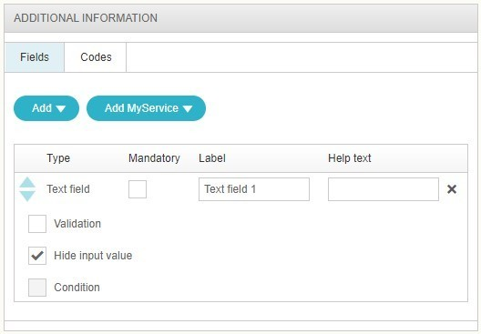

# ESS: Hide user input

**Källa:** https://community.efecte.com/t/m1hfflc/ess-hide-user-input
**Publicerad:** 2021-05-04T06:25:55.107Z
**Uppdaterad:** 2021-05-04T08:25:55.107000
**Författare:** 

---

ESS: Hide user input

      
    
          
      

        
              Juha HänninenProduct Owner
            

            ESM Product Owner
              Juha_Hanninen.1
            4 yrs agoTue, May 4, 2021 at 8:25 AM GMT+2
  

           Done
        

        
    

      
          

    
        
        
        
      

    

  ContentsUser story:AC:User story: 
 As an ESS admin, I want to enable hiding TextField input in additional information field, so that sensitive user information can be hidden in ESS.  
AC: 
 
 A checkbox shall be added to enable hiding user input for datatype TextField,  
 When enabled, user input shall be replaced with *********** already when the user is typing it. 
 The text shall remain hidden everywhere in ESS for all users, including 
   
   in the service confirmation page 
   in My Open Requests 
   in My Requests 
   in Our Requests 
   in My Things 
   in Approvals 
   in Requests for others 
    
 The text shall be seen in ESM as plain text 
 There shall be an eye icon to reveal the input in the TextField (only during input) 

          
    
        Self-Service Portal
      
    
  
  Vote
  Follow

## Bilder

