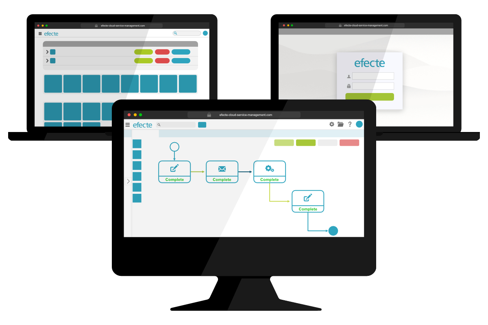

# Key Features from Efecte 2021.2

**Källa:** https://community.efecte.com/t/60hf7f9/key-features-from-efecte-2021-2
**Publicerad:** 2021-05-24T10:11:21.503Z
**Uppdaterad:** 2021-05-24T12:11:36.900000
**Författare:** 

---

Key Features from Efecte 2021.2

      
    
          
      

        
              Patrick Thurman
            

            Product Manager
              Patrick_Thurman
            updated 4 yrs agoMon, May 24, 2021 at 12:11 PM GMT+2
  

          
        

        
    

      
          

    
        
        
        
      

    

  ContentsKey Features from Efecte 2021.2Identity and Access Management CapabilitiesSelf-Service Capabilities The 2021.2 release of Efecte is now available for all customers. This release's new functionalities aim to help customers enhance their service management and identity governance. Included in addition to the listed features are further developments aimed at increasing performance and quality.  
Key Features from Efecte 2021.2 
Identity and Access Management Capabilities 
 Group lifecycle management for AD & AAD: Administrators can now verify, create, update, and delete groups to their identity repositories using event-based provisioning through ESM’s visual workflow automation.  
 Please note that these improvements are with the Efecte Provisioning Engine (EPE) component.  
 Enhanced event-based provisioning: Administrators can now choose if information relating to the organization unit (OU-path) is defined as a provisioning task or read from a datacard. This enhancement will allow organizations to use one provisioning task with selected information from the related dotard instead of multiple event-based provisioning tasks.  
 Please note that these improvements are with the Efecte Provisioning Engine (EPE) component.  
Self-Service Capabilities 
 Hide user inputs: Self-service administrators are now able to hide sensitive information provided using the datatype TextField. Administrators can flexibly define the fields which should have this feature. When enabled, user-provided information will be replaced with *****. 
          
    
        Self-Service Portal
      
    
        EPE
      
    
  
  Vote
  Follow

## Bilder

