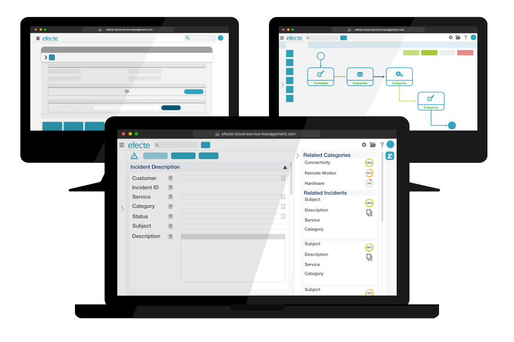

# Key Features of Efecte 2021.3

**Källa:** https://community.efecte.com/t/83hp7tg/key-features-of-efecte-2021-3
**Publicerad:** 2021-09-27T05:10:30.867Z
**Uppdaterad:** 2021-09-27T07:10:42.047000
**Författare:** 

---

Key Features of Efecte 2021.3

      
    
          
      

        
              Patrick Thurman
            

            Product Manager
              Patrick_Thurman
            updated 4 yrs agoMon, September 27, 2021 at 7:10 AM GMT+2
  

          
        

        
    

      
          

    
        
        
        
      

    

  ContentsKey Features from Efecte 2021.3Virtual Coach (AI) CapabilitiesSelf-Service CapabilitiesIdentity Governance and Administration Capabilities The 2021.3 release of Efecte is now available for all customers. This release's new functionalities aim to help customers streamline their service management and identity governance. Included in addition to the listed features are further developments aimed at increasing performance and quality.  
Key Features from Efecte 2021.3 
Virtual Coach (AI) Capabilities 
 Quick-fill for similar issues: Service management tool users can now copy and paste values from up to 3 defined attributes on a suggested datacard. When a data card is in edit all mode and the user opens the virtual coach, they will see a quick-fill button on the suggested datacards. When copying fields, the user will have the option to copy empty values or copy all values including changing existing values.  
Self-Service Capabilities 
 Improved commenting and file attachments: End-users are now able to attach files to existing requests and interactions from the self-service portal. This improvement is related to a general refresh of the entire commenting functionality within the self-service portal. When a single or multiple files are added, they will also be added within the existing comment chain for a more intuitive experience.  
Identity Governance and Administration Capabilities 
 Expanding supported directory provisioning: The provisioning capabilities of Efecte’s Provisioning Engine (EPE) now include scheduled- and event-based provisioning capabilities for several new user repositories. Administrators can now create scheduled-based provisioning for; IBM LDAP (IBM Directory Server), RedHat LDAP (FreeIPA), and OpenLDAP. In addition to this, administrators are also able to create event-based provisioning for OpenLDAP. 
          
    
        EPE
      
    
        Self-Service Portal
      
    
        Service Management Tool
      
    
        Virtual Coach
      
    
  
  Vote
  Follow
    
            1

## Bilder

