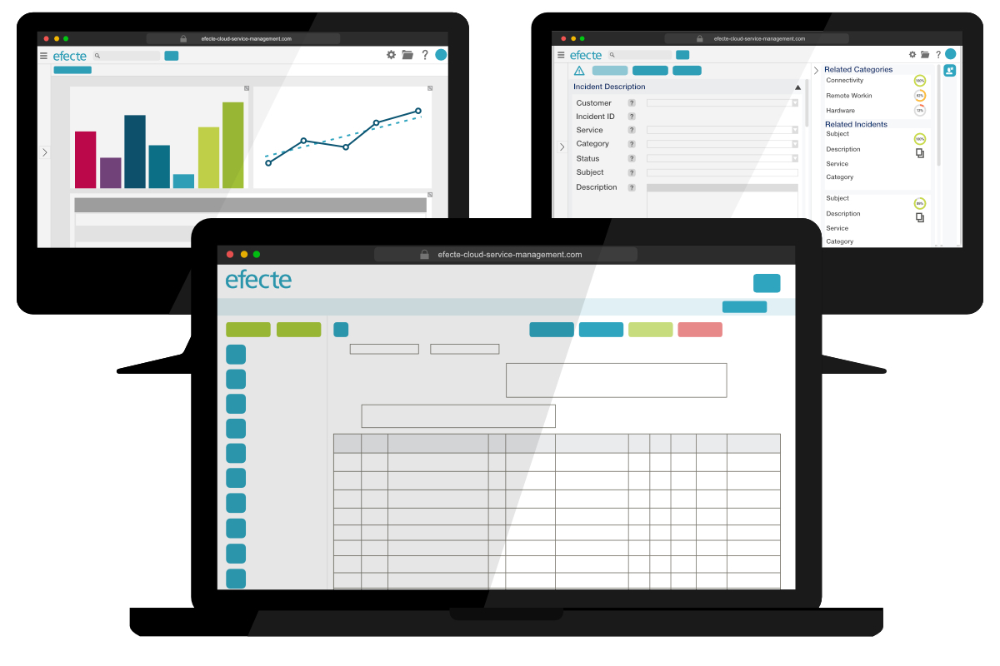

# Making a Difference: Efecte 2022.1

**Källa:** https://community.efecte.com/t/60h5cra/making-a-difference-efecte-2022-1
**Publicerad:** 2022-02-18T13:28:03.333Z
**Uppdaterad:** 2022-02-18T14:28:03.333000
**Författare:** 

---

Making a Difference: Efecte 2022.1

      
    
          
      

        
              Patrick Thurman
            

            Product Manager
              Patrick_Thurman
            3 yrs agoFri, February 18, 2022 at 2:28 PM GMT+1
  

          
        

        
    

      
          

    
        
        
        
      

    

  ContentsSome notable improvements are:Updating our UIIn Case You Missed It We decided to start the year off right with our 2022.1 release and focus on fixing many of the bugs and areas that can cause the most frustration and often have gotten overlooked. We prioritized these improvements and bugs based on their ability to have the most significant overall improvement to user experience. While this limited the overall number of new features included within this release, we felt it was an important step as part of our increased focus on end-user experience and quality.  
Some notable improvements are: 
 Extended number of visible nodes for line charts XLSX format for excel export Security improvements  
 
 Periodical and on-demand antivirus scan for file attachments 
 Upgrades to third party component versions (such as Tomcat, Hibernate) 
 Security improvements for excel exports 
 
 25 bug fixes related to:  
 
 Security fixes 
 UI-fixes  
 Fixes related to translation capabilities and translations 
 Fixes related to graph views 
 Fixes related to excel export 
 Fixes to email formatting and attachment handling  
 and many more! 
 
Updating our UI 
 In addition to these general improvements and fixes, we have also included a major development to improve the administration of our AI feature, “Efecte Virtual Coach.” The new admin interface uses drop-down selectors to allow a simplified experience by no longer requiring admins to be concerned about attribute codes. End users will also see an improvement through the ability to view rich text content through the preview window before copying a data card.  
 But that was not all that we have been up to. We have also taken the first steps needed for the UI developments planned for release later this year and been working on our new self-service product. We will be posting updates about both projects to the Efecte Community throughout the year, so be sure to keep an eye out for our latest developments.  
In Case You Missed It 
 Be sure to have a look at what was included in our last release: Efecte 2021.4! 
          
  Vote
  Follow

## Bilder

