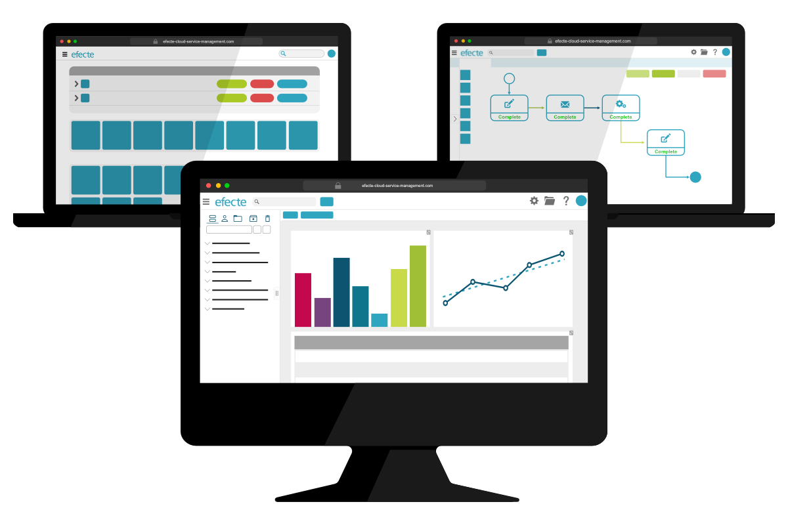

# A New Look: Efecte 2022.2

**Källa:** https://community.efecte.com/t/x2hd15t/a-new-look-efecte-2022-2
**Publicerad:** 2022-05-19T11:05:11.790Z
**Uppdaterad:** 2022-08-24T15:00:05.003000
**Författare:** 

---

A New Look: Efecte 2022.2

      
    
          
      

        
              Patrick Thurman
            

            Product Manager
              Patrick_Thurman
            updated 3 yrs agoWed, August 24, 2022 at 3:00 PM GMT+2
  

          1reply
        Steffan SchumacherEfecte Employee3 yrs agoMon, May 23, 2022 at 12:57 PM GMT+2
  
        
        

        
    

      
          

    
        
        
        
      

    

  ContentsKey Features from Efecte 2022.2Service Management CapabilitiesSecure Access CapabilitiesSelf-Service CapabilitiesIdentity Governance & Administraion The 2022.2 release of Efecte is now available for all customers. This release's new functionalities help customers boost the value of their service management and identity governance. Included in addition to the listed features are 18 Efecte Service Management Tool, 14 Efecte Self-Service, and 29 baseline improvements aimed at increasing performance and quality.   
Key Features from Efecte 2022.2 
Service Management Capabilities 
 Navigation Panel UI Renewal: The main navigation panel has a new look! We have removed the purposeless icons for each role to minimize unused space. Other significant changes include:  
 
 Views are sorted using tabs at the top of the panel. The separate tabs will show: roles, personal views, global views, folders, archive, and trash. 
 End-users can quickly find the views they are looking for by searching the name within the navigation search. 
 Personal views and role views can be grouped using folders to allow further sub-categorization. 
 End-users can now create views or dashboards by clicking the new corresponding button. 
 End-users can resize the navigation panel to minimize the space or maximize the available information. 
 The navigation panel can be instantly minimized by clicking the "dragger" icon. 
 
 Header UI Renewal: To optimize and improve the experience of both admins and end-users, the main header has received several improvements and changes. These include:  
 
 A scaling logo to eliminate the need for admins to use a logo meeting defined dimensions. 
 The ability for admins to flexibly center or left align the location of the search box and quick access links. 
 The addition of a universal quick access button allows end-users to create a new data card of any type. 
 
 Workflow Approval for Multiple Self-Services: Organizations can now send approval requests to Efecte Self-Service using the approval node. Admins may now add the approval as approval portal: "tenant, token, or URL" to match the corresponding and correct path enabling flexible and dynamic configurations many multi-nationals and MSPs require.  
Secure Access Capabilities 
 Login Window UI Renewal: The login window of Efecte Secure Access has now been redesigned to improve usability and experiences. A new login tab separates "company login" options from the "credential login" option. The tabs will only be visible when multiple login options are enabled.  
Self-Service Capabilities 
 Approval Delegations for All: Admins can now allow delegations to be set by all Efecte Self-Service users. When enabled, end-users can flexibly set their deputy through the approvals tab.  
Identity Governance & Administraion 
 Efecte IGA Growth: We are happy to announce that our news IGA package is now available. The IGA Growth package expands on IGA Starter with use cases for automating user lifecycle management and improving security & compliance. 
          
    
        ESA
      
    
        Self-Service Portal
      
    
        Service Management Tool
      
    
        IGA
      
    
  
  Vote
  Follow
    
            4

## Bilder

