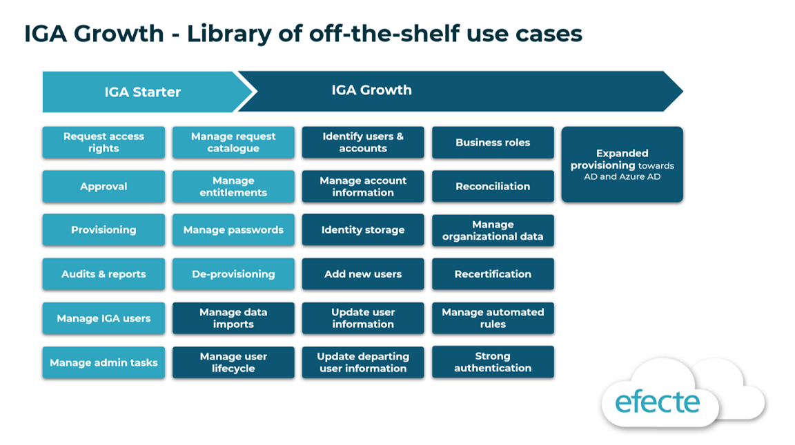

# Efecte IGA Growth is now available

**Källa:** https://community.efecte.com/t/q6hdf7q/efecte-iga-growth-is-now-available
**Publicerad:** 2022-05-16T13:21:49.957Z
**Uppdaterad:** 2022-05-16T15:21:49.957000
**Författare:** 

---

Efecte IGA Growth is now available

      
    
          
      

        
              Araceli del Rio SastreEfecte Employee
            

            Product Marketing Director
              Araceli_del_Rio_Sastre
            3 yrs agoMon, May 16, 2022 at 3:21 PM GMT+2
  

          

        
    

      
          

    
        
        
        
      

    

   Our IGA offering comes in three packages, with each option designed to meet different organizations’ needs:  
 
 IGA Starter provides essential use cases, reports and more, pre-packaged for quick deployment. 
 IGA Growth is designed to meet the needs of more demanding organizations (for example, those with more stringent security requirements or a need to automate user lifecycle management processes). 
 IGA Enterprise includes everything that large enterprises need to manage identity and access in line with internal policies and external requirements. 
 
 IGA Growth package is now available. It builds on IGA Starter package, expanding the solution with a selection of use cases for automating user lifecycle management and improving security and compliance, including for example access rights recertification, prevention of unwanted data exposure and breach of information via automated reconciliation. This use case selection is based on best practices from customer projects. IGA Growth use cases are shown in the image. 
          
    
        IGA
      
    
  
  Vote
  Follow

## Bilder

