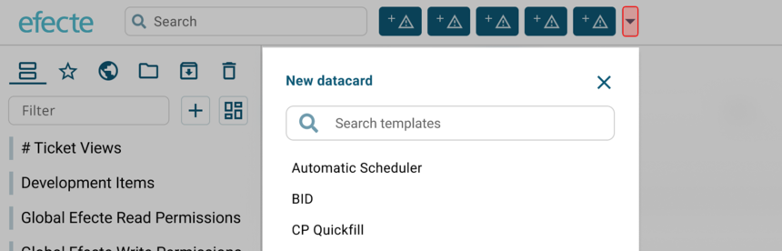

# ESM UI renewal - Header

**Källa:** https://community.efecte.com/t/83h5a0g/esm-ui-renewal-header
**Publicerad:** 2022-02-17T14:50:04.053Z
**Uppdaterad:** 2022-02-17T15:50:04.053000
**Författare:** 

---

ESM UI renewal - Header

      
    
          
      

        
              Aki Koivukoski
            

            R&D
              Aki_Koivukoski
            3 yrs agoThu, February 17, 2022 at 3:50 PM GMT+1
  

          1reply
        Nick BoettcherEfecte Employee3 yrs agoThu, February 17, 2022 at 4:40 PM GMT+1
  
        

        
    
 The header is our first item for the restart of the Efecte Service Management tool (ESM) UI renewal. It will include refreshed design we start to share between other UI components as well as one functional improvement.   
 We will get rid of the "hamburger" icon on top left corner. It has not been such widely used and the same functionality is available with another button next to the left navigation panel.  
 Administrators will have easier way to update the logo on the header. The logo will scale to the UI without the need for admin to resize it perfectly.   
 The quick access buttons that the users can define for them selves to create new data cards will go through small scale design refresh.   
 Admins will have new setting to define if the search and quick access buttons will be centered or left aligned as currently on the header. We will introduce through-out the year more capabilities for the admins to change the appearance of the UI to match more closely to their company brand and design.  
 Lastly, the quick buttons we introduced in 2021 for the users to have quick access for creating a certain type of data card directly from the header will have an additional feature. We are responding to the customer feedback and introducing an additional button next to the quick access buttons that can be used to create any data card through a drop down (simplified UI mock-up below).  
   
          
    
        Service Management Tool
      
    
  
  Vote
  Follow
    
            9

## Bilder

