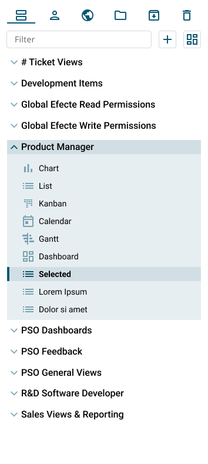

# ESM UI renewal - Navigation Panel

**Källa:** https://community.efecte.com/t/60h5aas/esm-ui-renewal-navigation-panel
**Publicerad:** 2022-02-17T15:14:35.710Z
**Uppdaterad:** 2022-02-17T16:31:37.787000
**Författare:** 

---

ESM UI renewal - Navigation Panel

      
    
          
      

        
              Aki Koivukoski
            

            R&D
              Aki_Koivukoski
            updated 3 yrs agoThu, February 17, 2022 at 4:31 PM GMT+1
  

          1reply
        Nick BoettcherEfecte Employee3 yrs agoThu, February 17, 2022 at 4:38 PM GMT+1
  
        

        
    
 The second item on the Efecte Service Management Tool (ESM) UI renewal will be the left hand side navigation panel.  
 Needless to say the design will go through a refresh. A little more than the header.  
 We will get rid of the icons on each role. Currently they all are the same and have no meaning. They will be replaced by an expand icon that can be used to open the list of items included in the role or folder. The views will still have the icons but with a refreshed look (UI mock up below).  
   
 The bigger functional changes will be how the views are organized. We will introduce tabs for the navigation panel to decrease the amount of different views shown at once. Tabs will include roles, personal views, global views, folder, archive and trash. Visible tabs will follow the access rights.  
 Another functional improvement is the introduction of filter/search for the views.  
 The current features to create a new view and a dashboard will be still available behind buttons and with no additional mouse clicks compared to current state.  
          
    
        IT Service Management
      
    
  
  Vote
  Follow
    
            10

## Bilder

