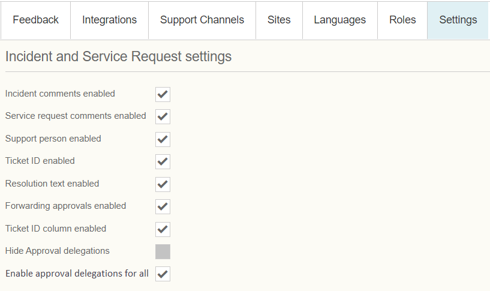

# ESS: Enable approval delegations for all

**Källa:** https://community.efecte.com/t/h7hfffl/ess-enable-approval-delegations-for-all
**Publicerad:** 2021-05-04T15:33:00.000Z
**Uppdaterad:** 2021-12-17T09:39:56.530000
**Författare:** 

---

ESS: Enable approval delegations for all

      
    
          
      

        
              Juha HänninenProduct Owner
            

            ESM Product Owner
              Juha_Hanninen.1
            updated 4 yrs agoFri, December 17, 2021 at 9:39 AM GMT+1
  

           Roadmapped
        

        
    
ContentsStory:AC:Story: 
 As an ESS admin,  
 I want to enable delegations for everyone,  
 so that delegations can be assigned beforehand.  
AC: 
 
 A checkbox shall be added in ESS admin site under "Incident and Service Request settings" for enabling approval delegations 
   
   This checkbox shall be mutually exclusive with "Hide approval delegations" checkbox 
   When "Enable delegations for all" is chosen, "Hide Approval delegations" shall be disabled and greyed out 
   When "Hide approval delegations" is chosen, "Enable delegations for all" shall be disabled and greyed out 
    
 When enabled, all ESS end users shall be able to choose a deputy 
 Delegation pane shall be visible on approvals tab only 
 
  
          
    
        Self-Service Portal
      
    
  
  Vote
  Follow
    
            3

## Bilder

