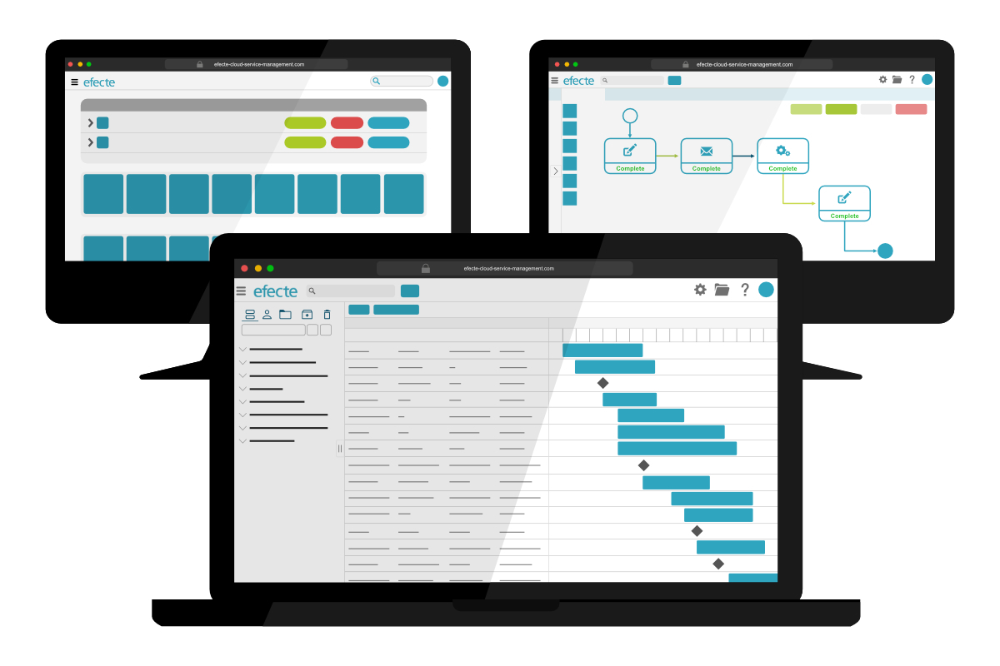

# Boost your processes: Efecte 2022.3

**Källa:** https://community.efecte.com/t/p8hnd66/boost-your-processes-efecte-2022-3
**Publicerad:** 2022-08-29T05:28:00.980Z
**Uppdaterad:** 2022-10-10T09:09:18.177000
**Författare:** 

---

Boost your processes: Efecte 2022.3

      
    
          
      

        
              Patrick Thurman
            

            Product Manager
              Patrick_Thurman
            updated 3 yrs agoMon, October 10, 2022 at 9:09 AM GMT+2
  

          
        

        
    

      
          

    
        
        
        
      

    

  ContentsKey Features from Efecte 2022.3Service Management CapabilitiesProvisioning Engine CapabilitiesSelf-Service Capabilities The 2022.3 release of Efecte will soon be available for all customers. This release's new functionalities help customers boost the value of their service management and identity governance. In addition to the listed features there have been numerous improvements aimed at increasing performance, quality, and experiences.  
Key Features from Efecte 2022.3 
Service Management Capabilities 
 Gantt view: All Efecte Service Management users can now create a Gantt-style view to help improve their visibility into projects and tasks. In addition to a standard Gantt chart new view also allows end users to quickly see a defining characteristic, i.e., name the chosen start date and end date and the duration. This new view will help users to:  
 
 Visualize track and follow-up projects and tasks quickly. 
 View all the steps included within multistep or complex processes like change and project management. 
 See critical data quickly, including each item's start date, end date, and duration. 
 
Provisioning Engine Capabilities 
 Flexible password rest policy: Administrators can now define, within workflows, if end-users must change their password after the first login following a reset. This feature works with both Microsoft AD and Azure AD.  
 Improved AD fetching: Efecte Provisioning Engine now allows administrators to fetch all AD users and groups or incrementally.  
Self-Service Capabilities 
 Negative conditions: Admins can now define negative conditions for forms to provide greater flexibility when building services. Negative conditions allow admins to specify that a specific field should be visible when a separate field does not have a value.  
 User experience improvements: We have made several small changes to improve end-user experiences. These changes include:  
 
 Layout optimizations to ensure that text does not expand outside the defined. UI elements and scales efficiently regardless of screen size when reviewing requests. 
 Expandable commenting text box to make it simpler for end-users to review the text before submission. 
 Limiting title size to ensure a more unified experience. Long texts will be limited to a maximum height; the full text will be visible when hovering over the tile. 

          
    
        EPE
      
    
        Self-Service Portal
      
    
        Service Management Tool
      
    
        Release Documentation
      
    
  
  Vote
  Follow
    
            1

## Bilder

