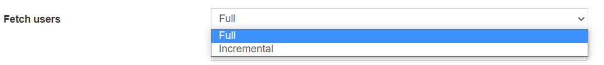

# EPE: support for incremental fetch of AD users and groups

**Källa:** https://community.efecte.com/t/y4hn8sy/epe-support-for-incremental-fetch-of-ad-users-and-groups
**Publicerad:** 2022-08-12T07:18:37.767Z
**Uppdaterad:** 2022-08-12T09:18:37.767000
**Författare:** 

---

EPE: support for incremental fetch of AD users and groups

      
    
          
      

        
              Tuija Länsisalmi
            

            
              Tuija_Lansisalmi
            3 yrs agoFri, August 12, 2022 at 9:18 AM GMT+2
  

          1reply
        Teppo Salminen3 yrs agoFri, August 26, 2022 at 10:09 AM GMT+2
  
         Done
        

        
    

      
          

    
        
        
        
      

    

   Efecte provisioning engine to support for incremental fetch of AD users and groups. EPE Administrators can make the selection for this directly from the EPE scheduled based AD provisioning. 
          
    
        EPE
      
    
        IGA
      
    
  
  Vote
  Follow
    
            1

## Bilder

