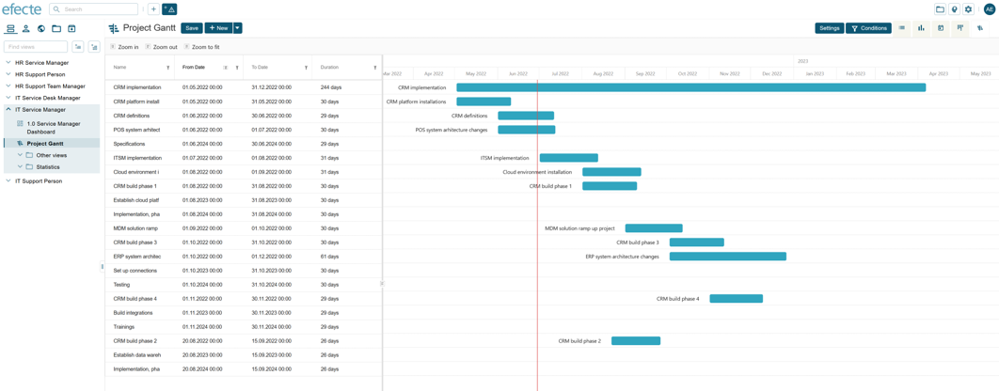

# ESM: Gantt view for visualizing datacards in relation to a timeline

**Källa:** https://community.efecte.com/t/g9hw61w/esm-gantt-view-for-visualizing-datacards-in-relation-to-a-timeline
**Publicerad:** 2022-06-29T14:47:39.890Z
**Uppdaterad:** 2022-06-29T16:47:39.890000
**Författare:** 

---

ESM: Gantt view for visualizing datacards in relation to a timeline

      
    
          
      

        
              Jonne KaukoProduct Manager
            

            Senior Product Manager & Product Lead, M42 Core & Pro
              Jonne_Kauko
            3 yrs agoWed, June 29, 2022 at 4:47 PM GMT+2
  

          

        
    

      
          

    
        
        
        
      

    

   As an user, I want to be able to see objects such as projects and tasks in relation to a timeline, in order to be able to manage them. Also, I want to be able to see the current date/time on the timeline, in order to understand the current progress in relation to the planned timeline.   
 The view should be a new view type that includes a data grid and a timeline view. It should also be possible to change the time scale. The user should be able to adjust the data grid and other properties of the view, including view settings and conditions, and then save the view as any other view in ESM.  
          
    
        Service Management Tool
      
    
  
  Vote
  Follow
    
            2

## Bilder

