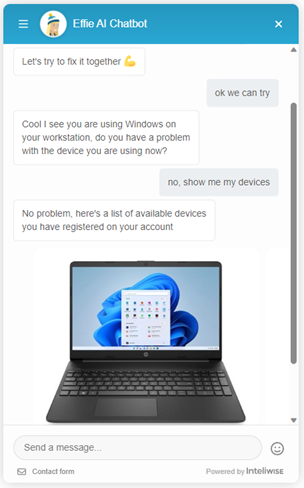
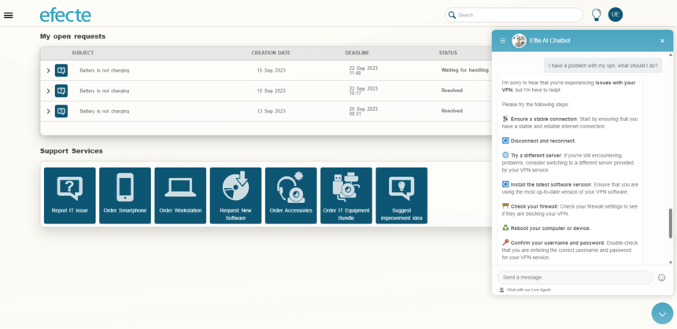
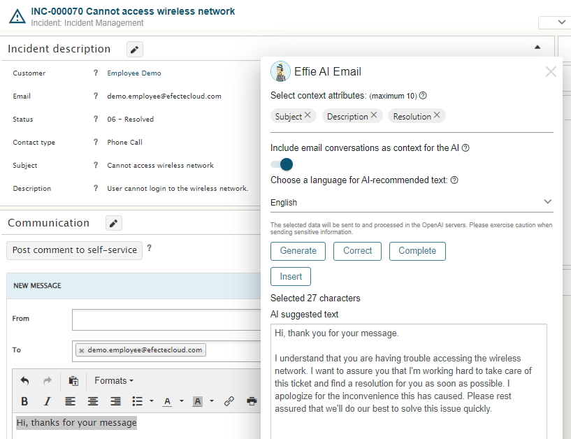
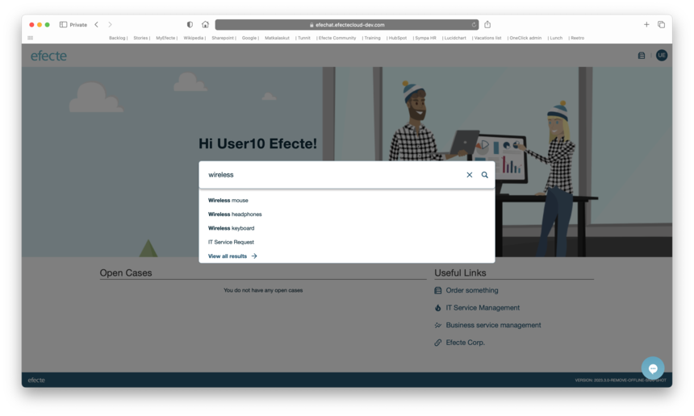
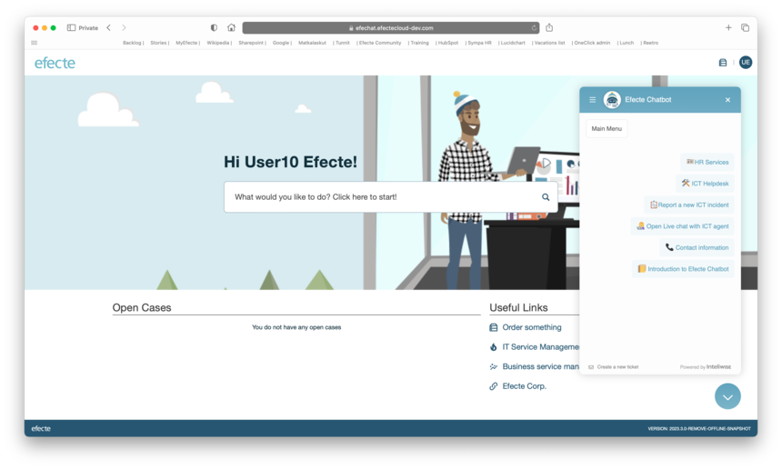

# Improved productivity with Efecte 2023.3

**Källa:** https://community.efecte.com/t/q6yq08a/improved-productivity-with-efecte-20233
**Publicerad:** 2023-09-18T07:38:00.000Z
**Uppdaterad:** 2024-04-18T07:35:09.513000
**Författare:** 

---

Improved productivity with Efecte 2023.3

      
    

        updated 1 yr agoThu, April 18, 2024 at 7:35 AM GMT+2
  
          
        

        
    

      
          

    
        
        
        
      

    

  ContentsEfecte 2023.3 HighlightsService Management CapabilitiesEffie AI product family - Available for pilots: Self-service CapabilitiesIdentity Governance Administration CapabilitiesProductized Atlassian Jira connector in Efecte Provisioning Engine (EPE): Improved administration of local users in EPE:You can find here an overview of what's new in 2023.3 and its release notes.
This release's new functionalities help customers improve their productivity with service management and identity governance. You can read about all of the 2023.3 features, improvements and bug fixes included in this release in Efecte Docs. Please get in touch with our servicedesk@efecte.com if you cannot access the link or have questions about upgrading.
Efecte 2023.3 Highlights
Service Management Capabilities
Effie AI product family - Available for pilots: 
Effie AI is a new Efecte product family which brings AI capabilities to Efecte solutions, starting with IT Service Management. The new product family includes Effie AI for End-users and Effie AI for Agents.
Effie AI for End-users empowers users to solve simple issues on their own, quickly, 24x7. Effie AI for End-users includes the following features: Effie AI Chatbot (NLP based), rule-based Chatbot and Live Chat. 
 

Effie AI for Agents helps agents to manage increasing complexity and workloads efficiently. Effie AI for Agents includes the following features: Effie AI Email, Effie AI Chat (previously known as GPT-powered Chat) and Effie AI Ticket (previously known as Virtual Coach).
 
  
 
With Effie AI we leverage the latest Generative AI and Natural Language Processing technologies, and we ensure that customers have the option to keep their data local, and to choose between local models and Open AI models.
Effie AI reduces ticket volumes and cost per ticket, helps to get faster resolution times and improve the overall user experience, both for end-users and agents.
Effie AI capabilities are a premium add-on which can be used with Efecte IT Service Management.
 
Improvements to email UI in renewed Efecte Service Management (ESM) UI: 
Users of Efecte Service Management Tool (ESM) can enjoy now a modern user interface for reading and creating emails. We are introducing several improvements to the email UI to prepare it for production use.  This includes capabilities such as rich text and attachment handling. The email editor capabilities are extended in various ways, while also improving the visual appearance and accessibility. 
Self-service Capabilities
Efecte Self-service improvements:
2023.3 release significantly improves the accessibility of the product. The new accessibility mode comes with multiple improvements that help with the usability of Efecte Self-service. We are also introducing the new My Employees page to allow managers to see more relevant information in the Self-service portal. Additionally, we have enhanced form configuration flexibility by enabling admins to add multiple options for conditionally showing a dropdown menu.
This version supports the following languages: Czech, Croatian, Danish, Dutch, English (GB & US), Estonian, Finnish, French, German, Italian, Latvian, Lithuanian, Norwegian, Polish, Russian, Spanish and Swedish.
The following browsers are supported: Google Chrome, Microsoft Edge, Mozilla Firefox, Mozilla Firefox ESR, Safari 16.5 or newer.
Efecte Self-service 2 improvements:
2023.3 release includes several enhancements, including search functionality, administration of Forms and support for new field types. 
 Additionally, Efecte Chat for Service Management can be now used in Efecte Self-service 2.

Identity Governance Administration Capabilities
Productized Atlassian Jira connector
Administrators are now able to configure the connection to Efecte ESM using EPE administration UI. Available for EPE customers with Efecte IGA.  
Improved administration of local users in EPE:
administrators can now update ESM local users’ username and delete local users easily with workflow.  
 
 
          
    
        IT Service Management
      
    
        IGA
      
    
        EPE
      
    
        ESS2
      
    
        Self-Service Portal
      
    
        Service Management Tool
      
    
        Chat
      
    
  
  Like
  Follow
    
            1

## Bilder

