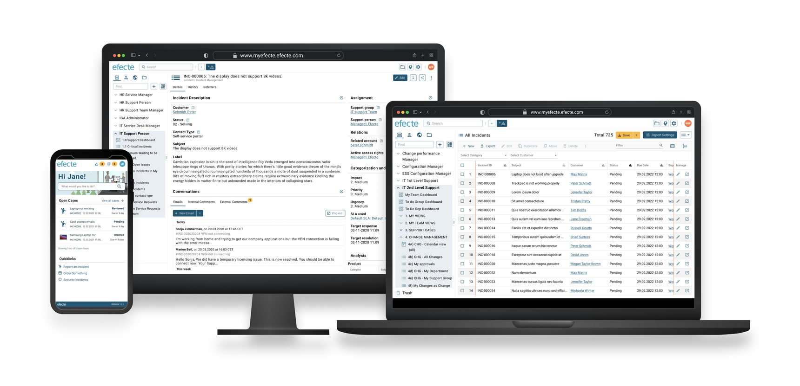
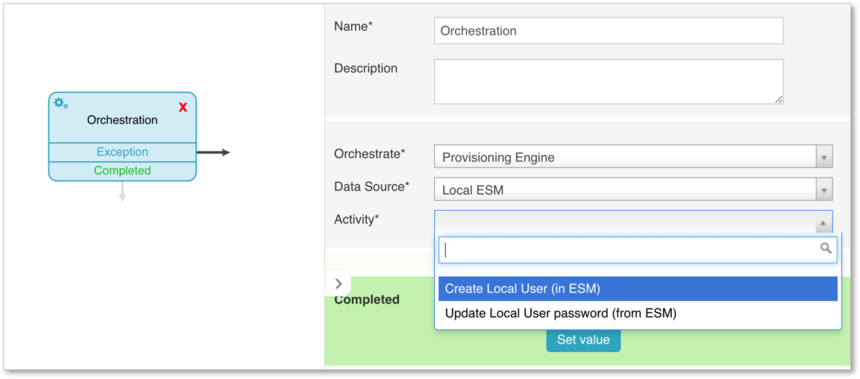
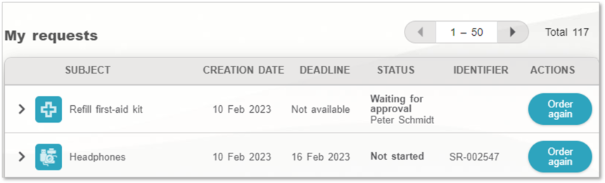

# Work smarter with Efecte 2023.1

**Källa:** https://community.efecte.com/t/m1hamka/efecte-20231
**Publicerad:** 2023-02-16T06:37:00.000Z
**Uppdaterad:** 2023-03-10T11:40:35.030000
**Författare:** 

---

Work smarter with Efecte 2023.1

      
    

        updated 2 yrs agoFri, March 10, 2023 at 11:40 AM GMT+1
  
          
        

        
    

      
          

    
        
        
        
      

    

  ContentsEfecte 2023.1 HighlightsService Management CapabilitiesSelf-Service CapabilitiesProvisioning Engine and Secure Access Capabilities You can find here an overview of what's new in 2023.1 and its release notes.  
 This release's new functionalities help customers improve their service management and identity governance. The release includes numerous improvements targeting to help users work smarter and enhance their experience.  
 To read about all of the 2023.1 features, improvements, and bug fixes included in this release, please see the complete release notes from Efecte Docs. Please get in touch with our servicedesk@efecte.com if you cannot access the link to release notes or have questions about upgrading.  
Efecte 2023.1 Highlights 
Service Management Capabilities 
 Automation of local user creation: Adding local users is now possible in ESM from the Visual Workflow without root level access. Orchestration nodes are used to trigger user creation from the automation, e.g.: local users can be created by Efecte Provisioning Engine from Self-Service, without access as configuration admin. This feature is leveraged by both ITSM and IGA solutions. Administrators save time when creating external users such as subcontractors or partners. The feature benefits also MSP admins who need to allow key customer users to log in for report inspection.  
   
 Improving troubleshooting efficiency with Visual Workflow Automation (VWA) logging: admins can now track automations and inspect workflow execution in detail. The new workflow.log file includes each workflow step and provides details about each workflow node. As for the previous feature, this one is leveraged by both ITSM and IGA solutions.  
 Improving the agent experience: Efecte Chat for Service Management introduces improvements to usability and reporting. The chat window shows now all tickets related to an end-user session. Additionally, agent response times are stored in data cards, which allows to follow up service delivery performance.    
Self-Service Capabilities 
 Automation of repetitive service requests: Often users need to repeat certain service orders in Self-Service over and over again. Repetitive service requests, such as "Refill first aid kit", can now be ordered again easily, as the order details are prepopulated based on previous order.   
    
 Improving user experience with notifications: Admins have now the option to define expiration times for end-user notifications in Self-Service, i.e. how long a notification is visible in the UI when user has created a ticket or ordered a device. Once expiration time is defined, notification goes away without any action required by user.    
 Two new languages available: Efecte Self-Service is now available also in Bulgarian and Romanian.  
Provisioning Engine and Secure Access Capabilities 
 Faster identification of errors: Administrators can now download logs easily from ESM UI. This feature reduces the need for host access when configuring ESA and EPE. It speeds up the process of finding errors and it is much easier for admins to view logs.  
 Improved login experience: New languages supported in login screen with Efecte Secure Access (ESA). Available languages for end-user are English US, English UK, Finnish, German, Swedish, Polish, Croatian, Czech, Danish, Dutch, Estonian, French, Italian, Latvian, Lithuanian, Norwegian, Russian, Spanish and Turkish. Administrators can easily define default language options.  
 Technology update: Efecte Secure Access (ESA) server update. ESA is built on Keycloak (https://www.keycloak.org/), an Open Source application that provides authentication services, which Efecte has customized. The WildFly distribution support has ended and following Keycloak recommendation, we are migrating servers to Quarkus and updating to version 20.0.3, which includes ESA Admin UI renewal. This is for customers' information and it does not require any action. 
          
  Like
  Follow
    
            5

## Bilder

