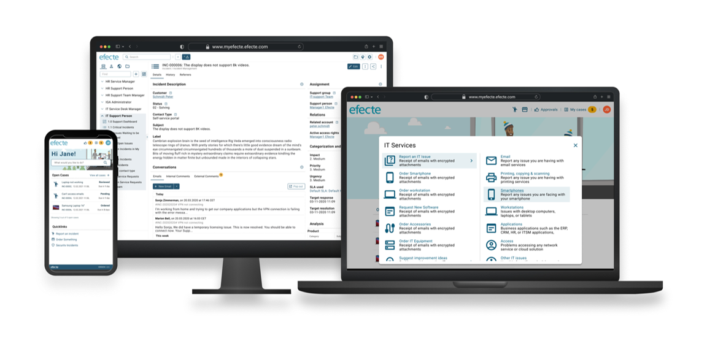
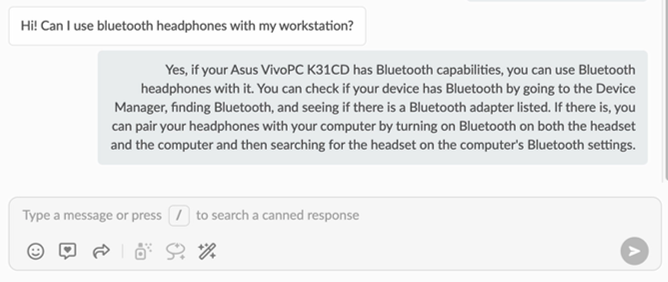
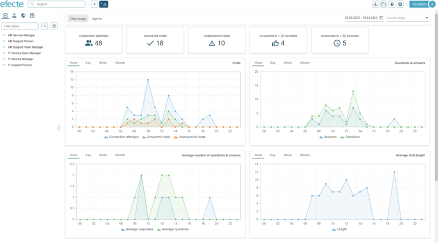
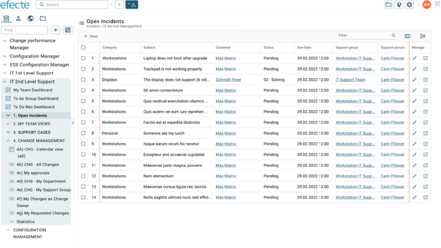
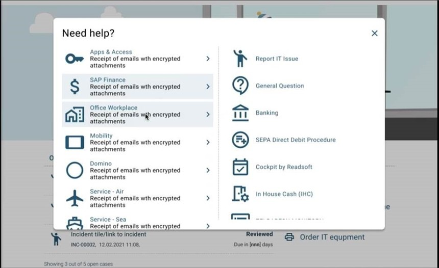

# Improved experience with Efecte 2023.2

**Källa:** https://community.efecte.com/t/60hc2vl/efecte-20232-highlights
**Publicerad:** 2023-04-24T09:05:00.000Z
**Uppdaterad:** 2023-09-18T10:07:04.567000
**Författare:** 

---

Improved experience with Efecte 2023.2

      
    

        updated 2 yrs agoMon, September 18, 2023 at 10:07 AM GMT+2
  
          

        
    

      
          

    
        
        
        
      

    

  ContentsEfecte 2023.2 HighlightsService Management CapabilitiesSelf-Service CapabilitiesIdentity Governance Administration CapabilitiesSecure Access Capabilities You can find here an overview of what's new in 2023.2 and its release notes.  
 This release's new functionalities help customers improve their service management and identity governance.   
 You can read about all of the 2023.2 features, improvements and bug fixes included in this release in Efecte Docs. Please get in touch with our servicedesk@efecte.com if you cannot access the link or have questions about upgrading.  
Efecte 2023.2 Highlights 
Service Management Capabilities 
 GPT-powered Chat - Available for pilots: this capability brings generative AI technology to Efecte Chat for Service Management, to help agents respond faster and effectively to employees and customers in any language. It means more conversations with less effort. GPT-powered Chat includes 3 use cases: 1) autogenerate, which supports agents with contextual & accurate suggestions by integrating service management data; 2) autocorrect, which can be used to correct grammar mistakes and replace casual language with more formal alternatives to ensure clarity; and 3) autocomplete, which predicts sentence completion to save effort & respond faster.    
 This capability is an optional feature and requires Efecte Chat for Service Management.  
     
 Reporting module for Efecte Chat for Service Management: service managers can now view chat statistics and accordingly plan support capacity. Both chat usage and agent statistics are included, such as: connection attempts, answered chats, unanswered chats, number of answers/questions, average chat length, agent load and agent availability.  
  
    
 Modernized agent UI with new list and data-card views - Early access beta version: Users of Efecte Service Management Tool (ESM) can now enjoy a redesigned user interface for viewing and editing data through new list and data-card views. These two view types are the ones that are used for running every process and activity across the tool. This early access beta version is available for cloud and private cloud environments. The beta UI is not available for on-prem installations running on Windows or Linux servers.  
  
   
 Your feedback regarding the beta-version of the new agent UI is very appreciated. You can provide feedback in the following link: https://community.efecte.com/t/p8h4qd9/give-us-feedback-to-the-early-access-beta-version-of-the-list-view  
Self-Service Capabilities 
 Categorization for improved user guidance: with this feature, more support processes can be published in our new Self-Service.    
 New categories and subcategories will guide users to provide the information required by the IT support team, who will get more accurate information from users, thus improving efficiency. This will help to decrease the time to resolve an issue in IT Service Desk. In the next step, tickets will be automatically assigned to specific support groups.  
 The feature will also help to speed up any enterprise process, for example facility management. Users will be guided to provide the information required by the corresponding support group, such as facility service team or cleaners.  
 System admins can define the new categories and subcategories in a single admin UI.  
  
    
  
Identity Governance Administration Capabilities 
 Productized HR connector in Efecte Provisioning Engine (EPE): capability to enable automated provisioning / writing of data from EPE to HR systems. Data can be provisioned via custom script, event-based provisioning task, workflow and orchestration node.  The productized HR connector will significantly decrease the time to integrate IGA solution to HR systems. This integration is required to deploy user lifecycle management use cases.  
 ESM connector in EPE: capability which connects Efecte ESMs via EPE. Admins are able now to configure the connection in EPE admin UI. Any data card can be provisioned from one ESM to another by using event-based provisioning task, workflow and orchestration node.  
Secure Access Capabilities 
 Secure Access enhancements:  Brute force detection is now enabled for all customers using Efecte Secure Access. This means that user accounts can be temporally disabled if the number of login failures exceeds a threshold, thus blocking potential attackers. Also clickjacking protection will prevent attacks related to embedded web pages within an iframe, which trick the user into clicking on hidden or disguised buttons or links. 
          
    
        IT Service Management
      
    
        Chat
      
    
        IGA
      
    
  
  Like
  Follow
    
            4

## Bilder

