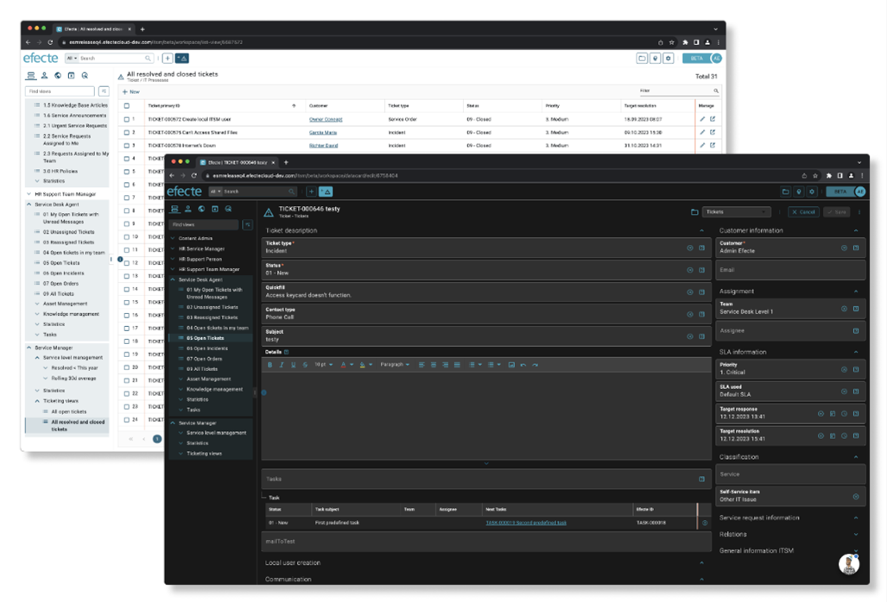
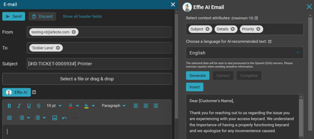
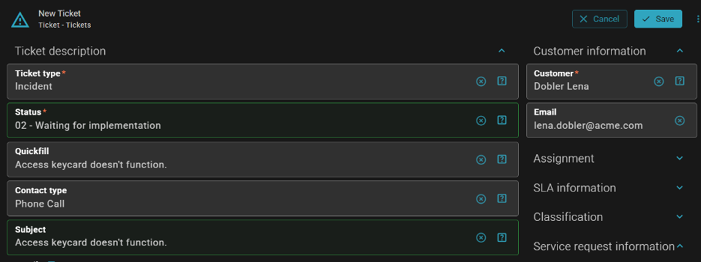
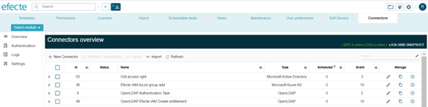

# Secure AI with Efecte 2023.4

**Källa:** https://community.efecte.com/t/x2y3t3l/secure-ai-with-efecte-2023-4
**Publicerad:** 2023-12-19T11:50:00.000Z
**Uppdaterad:** 2024-08-23T12:51:27.953000
**Författare:** 

---

Secure AI with Efecte 2023.4

      
    

        updated 1 yr agoFri, August 23, 2024 at 12:51 PM GMT+2
  
          

        
    

      
          

    
        
        
        
      

    

  ContentsEfecte 2023.4 HighlightsService Management CapabilitiesEffie AISelf-Service CapabilitiesEfecte Self-Service 2 improvementsEfecte Self-Service improvementsIdentity and Government Administration CapabilitiesYou can find here an overview of what's new in 2023.4 and its release notes.
This release's new functionalities bring secure Generative AI capabilities and help customers accelerate their productivity with service management and identity governance. You can read about all of the 2023.4 features, improvements and bug fixes included in this release in Efecte Docs. Please get in touch with our servicedesk@efecte.com if you cannot access the link or have questions about upgrading.
 
Efecte 2023.4 Highlights
Service Management Capabilities
With 2023.4 release, we make the life of service desk agents easier and improve efficiency in their day-to-day work in two ways: with Effie AI assistant and with the renewal of Agent UI.
Effie AI
A few months ago, we launched Effie AI, a friendly digital assistant that helps agents work smarter. We are now bringing the first improvements to Effie AI based on our first pilots. Additionally, our own Efecte-hosted Large Language Model, called Efecte GenAI, is available for piloting with Effie AI Email in February. By using Efecte GenAI, customers can benefit from generative AI technology without integrating with external services (e.g. OpenAI).
Efecte GenAI will support English in the piloting phase. Full multi-language support is in an early-access state and can be enabled for testing purposes.
You can easily check Efecte GenAI service availability and your used quota on the Effie AI Email administration page. 
 

  

Agent UI renewal
With upcoming additions, agents will be able to perform basic daily support tasks with the new UI.
Agents will be able to:

 Get support for reading and comment on tickets as a conversation on a data card by using the Worklog handler in the new UI.
 Fill in multiple fields in one go based on a single selection with the Quickfill handler.
 Check reference tables and do sorting, multi-sorting, column resizing that persists over different tabs, and lazy loading on scroll. The addition includes also a couple of new metadata values to select which columns are shown in the tables and whether removal of references is allowed.
  Opt for dark theme in the new Agent UI in addition to the default theme.

 
Self-Service Capabilities
Efecte Self-Service 2 improvements
We continue to enhance the new Self-Service to meet customers’ needs. In this release we will bring again important additions, like new form visuals, capabilities, and administrative tools to offer better end-user experience and control of forms without touching the backend process template.
The 2023.4 release additions enable administrators to:

 Add titles and text blocks to forms when configuring them to guide end users while filling out issues on the ESS2 user interface.
 Create a form field, define a custom set of drop-down values, and map the field to the text attribute in the Self-service configuration area. Administrators can configure multiple single line fields to one text attribute on the target template to ask more specific customers depending on the form topic. 
 Define the reference field from the target template as a form field, with reference values in the forms. When end users are reporting an issue with the form where the reference field is selected as the form field, the chosen reference value is filled automatically in the created datacard. With support to define reference values in the 'Override defaults' configuration, administrators can define predefined values e.g., assigning an issue to a named support group or earmarking the issue to a specific Service. 
 Define which data card fields are visible for end-users, who can now read relevant details related to their open issues and orders. These include e.g.: ticket ID, SLA, priority, category, ticket owner or ticket resolution, once the issue is resolved. This new data presentation feature brings more control for the admin and improves end-user experience. Note: the new data presentation needs to be enabled separately.

 
Efecte Self-Service improvements
Efecte Self-Service 2023.4 release significantly improves the accessibility of the product to meet Web Content Accessibility Guidelines (WCAG 2.1 A and AA) definitions, including improvements to support the use of screen readers.
Implementing WCAG offers businesses key advantages, such as: expanding market reach by making products and services accessible to a broader audience; compliance with accessibility standards, which mitigates legal risks; and a commitment to accessibility enhances brand reputation, showcasing a company's focus on user experience.
 
Identity and Government Administration Capabilities
We have redesigned the Efecte Provisioning Engine (EPE) page for premade connectors, to enable easier and faster connector configuration. The new page will be gradually available in customer environments. We will communicate with customers individually when their environments are updated.

          
    
        IT Service Management
      
    
        IGA
      
    
        EPE
      
    
        Effie AI
      
    
        Self-Service Portal
      
    
        Chat
      
    
  
  Like
  Follow
    
            4

## Bilder

