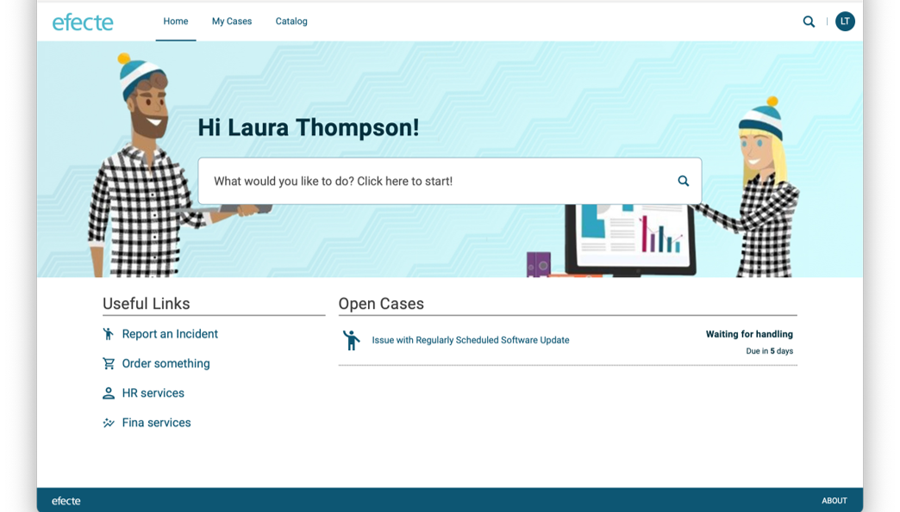
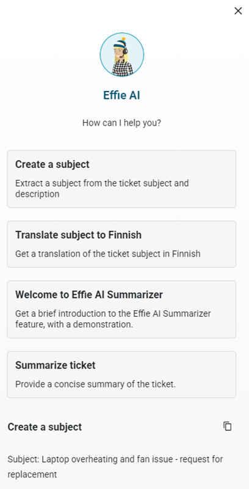
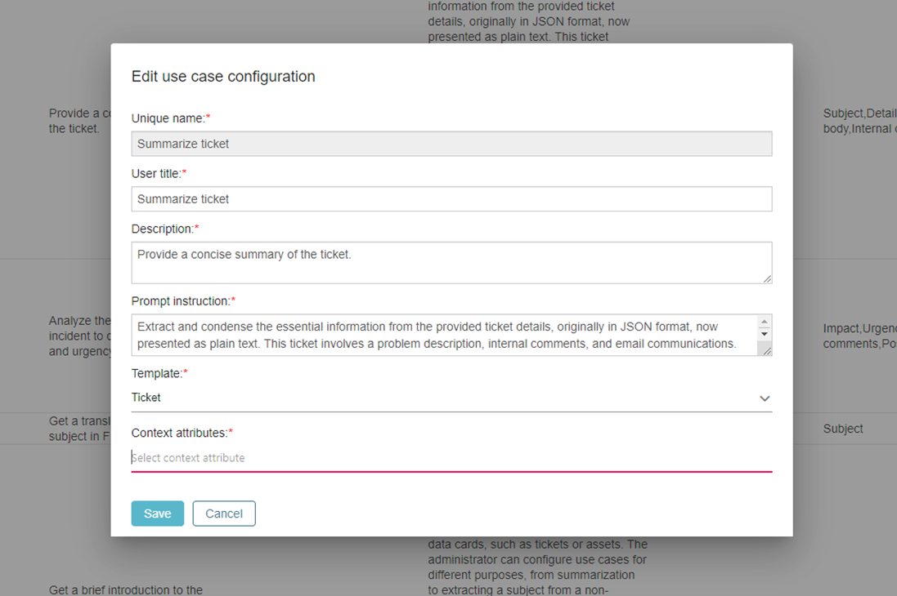
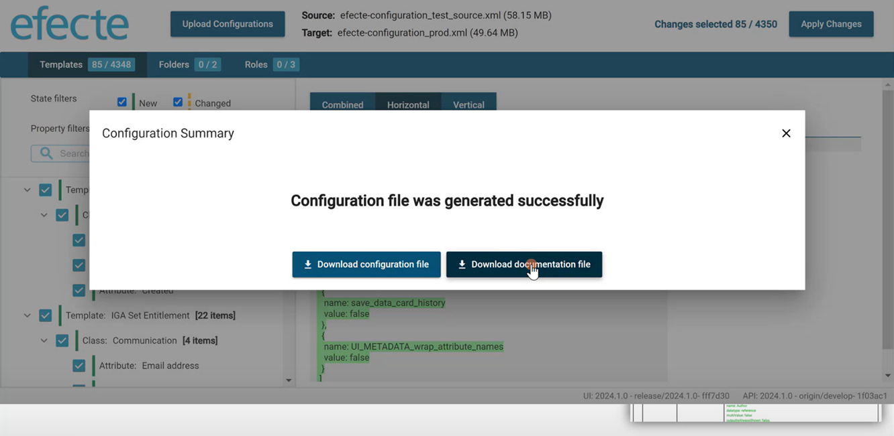
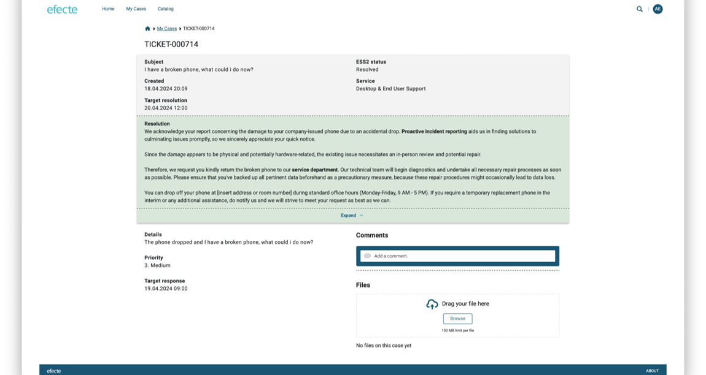

# Release 2024.1 Highlights

**Källa:** https://community.efecte.com/t/35y6ftg/release-2024-1-highlights
**Publicerad:** 2024-04-18T05:35:00.000Z
**Uppdaterad:** 2024-04-23T07:52:26.803000
**Författare:** 

---

Release 2024.1 Highlights

      
    

        updated 1 yr agoTue, April 23, 2024 at 7:52 AM GMT+2
  
          6replies
        Araceli del Rio SastreEfecte Employee1 yr agoThu, September 12, 2024 at 7:03 AM GMT+2
  
        

        
    

      
          

    
        
        
        
      

    

  ContentsEfecte 2024.1 HighlightsService Management CapabilitiesEffie AI Self-Service CapabilitiesEfecte IntegrationsIdentity Governance and Administration CapabilitiesYou can find here an overview of what's new in 2024.1 and its release notes.
This release's new functionalities bring new AI and Agent UI capabilities and help customers improve their efficiency and security with service management and identity governance. You can read about all of the 2024.1 features, improvements, and bug fixes included in this release in EfecteDocs. Please get in touch with our servicedesk@efecte.com if you cannot access the link or have questions about upgrading.
Efecte 2024.1 Highlights
Service Management Capabilities
With 2024.1 release, we go one step further in making the life of service desk agents easier and improving efficiency in their day-to-day work.
Effie AI 
We launched Effie AI in September 2023, a friendly digital assistant that helps agents and end-users work smarter. In release 2023.4 we brought the first improvements to Effie AI based on our first pilots and Efecte-hosted Large Language Model, called Efecte GenAI. By using Efecte GenAI, customers can benefit from generative AI technology without integrating with external services (e.g. OpenAI).
Now in release 2024.1 we are introducing the Effie AI Summarizer feature, which helps agents extract information from any ticket or data card quickly, produce high-quality text with a single click, translate, or summarize content for a specific audience.
The use cases can be defined by the administrator, and the content is generated based on fields selected also by the administrator.
The feature comes with several predefined use cases, as shown by the figure below.

Administrators have the option to configure additional use cases on their own. No additional product development is needed for that.

The Summarizer feature is provided as early access in the new Effie AI Admin UI, to allow users to start testing it and benefit from it for free. The free usage limit allows 1000 generated summaries per month, and users can configure a maximum of 5 use cases.
Release 2024.1 also brings:

 The option to leverage the Open AI model in the customer’s own Azure tenant that they trust for other applications and use cases
 ESM admins can now set up Effie AI Email and Effie AI Ticket (formerly known as Virtual Coach) in the same area of ESM Admin UI, called Effie AI Settings. There are separate tabs for setting up the individual features

 
Agent UI renewal
With upcoming Agent UI extensions and improvements, agents will be able to perform basic daily support tasks more efficiently:

 A new, improved view settings editor that allows users to filter relevant information to the views and applying settings to filter out data in views
 Read-only mode for conditions
 An improved approach for saving views with “Save” and “Save as” options

We are planning to provide access to the new Agent UI by default starting in 2024.2 release.
For now, accessing the new Agent UI still requires the admin to enable the access with the platform setting new.ui.switch.enabled.
A few practical notes about providing access to new UI by default:

 The UI switch in the top right corner is available for all users
 Having the new UI available by default does not prevent using the classic UI
 Having access to new UI by default does not make it the default option when logging in
 The New Agent UI is not available in the on-prem version of ESM

 
Configuration Transport Tool (CTT)
There are new features and improvements in CTT, which include:

 Automatic documentation of configuration changes provided in a PDF file
 Search and improved filtering for finding configuration changes easily
 A variety of smaller improvements and fixes  

Self-Service Capabilities
The Efecte Self-Service 2 (ESS2) 2024.1 release announces several new features:

 Enhanced user experience with conditional fields which can be configured by administrators, significantly enhancing the user-friendliness of form completion. With the configuration option, administrators now have the flexibility to design forms such that all fields don't activate at once. Instead, these conditional fields will activate in response to the choices end users make during case reporting, making for a more intuitive and streamlined user experience.
 Improved case presentation will be more user-friendly and visually appealing. It will include an overview area for the most important fields and a dedicated area for resolution text.
 Extended multi-mapping capabilities with the portal admin, which will be able to map any form field to any text type of attribute in the target template.
 Filtering reference form fields, which allows the admin to add a filter to the reference attribute that is used as a source of the reference type of form field. Once the filter is configured, the end-user will see only the content that is relevant for them.
 My cases expansion, which shows open and closed cases separately under the My Cases page. The admin will be able to add a second dashboard for closed cases, which will allow end-users to have a more filtered view to browse their created issues.
 ESS2 homepage update to ensure a user-friendly experience for the most used topics. The update includes a new layout for header area links, a horizontally narrower background image, and useful links moved to the left-hand side of the "My cases" section.

Efecte Integrations
We have updated our Efecte Integrations offering, which enables customers and partners to integrate their Efecte solutions into different applications, directories and interfaces. The new Efecte Integrations offering builds on three pillars which address different business needs: native connectors, Integration as a Service and open API.
Native connectors are meant specially for generic integrations. They are designed to facilitate direct and efficient integration between Efecte’s platform and a wide variety of external applications and directories without 3rd party middleware tools. These connectors enable the automated flow of data to and from Efecte, streamlining processes across Identity Governance and Administration (IGA), IT Service Management (ITSM), and Enterprise Management solutions. They are easy to use and configure, and they help customers and partners to bring solutions fast to market. Efecte native connectors include a connector management admin panel and usage data. All connectors can be configured within the Efecte platform.
Native connectors have their own pricing and they will have their own separate upgrade timing for release 2024.1, which will be communicated to customers before their environments are upgraded.
Integration as a Service, based on Efecte Integration Service (EIS), is meant for complex and customer specific integrations. It ensures the integration fits perfectly with any application, and it is sold as a service managed by Efecte. The integration is designed, built and maintained by Efecte integration experts. EIS pricing has been updated to address customer needs.
Open API is for customers and partners to build their own integrations and it is developer friendly. Typical use case examples are the streamlining of operations with integration between ITSM and Enterprise SM, and integration to partner's integration platform. Efecte Open API is a modern Rest API with online development environment and online documentation, and it allows access to all Efecte data cards. REST API pricing thresholds  have been updated to address partner and customer needs.
Identity Governance and Administration Capabilities
Release 2024.1 includes also an additional improvement related to IGA solution: Efecte Secure Access (ESA) supports Keycloak and Okta authentication.
          
    
        Effie AI
      
    
        IT Service Management
      
    
        ESS2
      
    
        Service Management Tool
      
    
        ESA
      
    
        IGA
      
    
  
  Like
  Follow
    
            6

## Bilder

