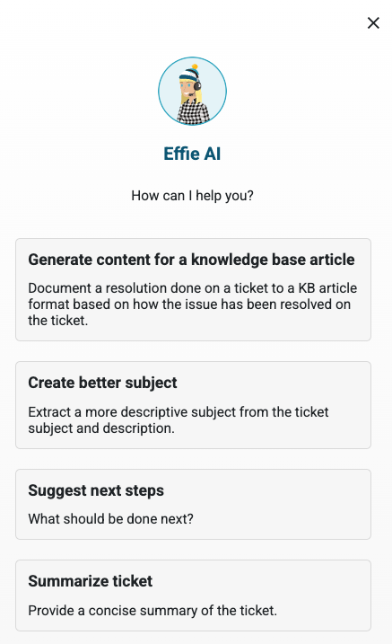

# Release 2024.2 Highlights

**Källa:** https://community.efecte.com/t/x2ytd1l/release-2024-2-highlights
**Publicerad:** 2024-09-12T12:39:00.000Z
**Uppdaterad:** 2024-09-19T12:09:47.653000
**Författare:** 

---

Release 2024.2 Highlights

      
    

        updated 1 yr agoThu, September 19, 2024 at 12:09 PM GMT+2
  
          

        
    
ContentsEfecte 2024.2 HighlightsService Management CapabilitiesConfigurable AI with Effie AI ActionsEffie AI enhancementsAgent UI renewalRemote assistance Risk ManagementSelf-Service CapabilitiesIdentity Governance and Administration Capabilities
You can find here an overview of what's new in 2024.2 and its release notes.
This release's new functionalities bring enhanced AI and UI capabilities and help customers improve their efficiency with service management and identity governance. We are also bringing a new out-of-the-box risk management solution.
You can read about all of the 2024.2 features, improvements, and bug fixes included in this release in EfecteDocs. Please get in touch with our servicedesk@efecte.com if you cannot access the link or have questions about upgrading.
Efecte 2024.2 Highlights
Service Management Capabilities
With 2024.2 release, we go one step further in making the life of service desk agents easier and improving efficiency in their day-to-day work. We are also bringing a new out-of-the-box risk management solution to address EU directives such as NIS2 and DORA.
Configurable AI with Effie AI Actions
We launched Effie AI in September 2023 as a friendly digital assistant designed to help both agents and end-users work smarter. In the 2023.4 release, we introduced the first enhancements to Effie AI, powered by our Efecte-hosted Large Language Model, Efecte GenAI. This allows customers to leverage generative AI technology without needing to integrate external services like OpenAI.
In the 2024.1 release, we introduced the Effie AI Summarizer, which enables agents to quickly extract information from tickets or data cards, generate high-quality text with a single click, and translate or summarize content for different audiences.
We are now renaming the Effie AI Summarizer to Effie AI Actions to better reflect its expanded capabilities and configurable nature. Effie AI Actions offers organizations a toolkit to create custom generative AI use cases tailored to their specific IT and business needs, without requiring additional product development. Administrators can configure these use cases independently. Effie AI Actions is now generally available.
Effie AI Actions also comes with a free trial, allowing up to 5 configurable actions and 1,000 action credits per month. Please note that access to a large language model is required to power the feature. You can contact us for support in trying Efecte GenAI with Effie AI for Agents, or alternatively, connect your own OpenAI or Azure OpenAI tenant to Effie AI.

 
Effie AI enhancements
Other Effie AI improvements include:

 Efecte-hosted Large Language Model (LLM), called Efecte GenAI now has BETA state multi-language support for Effie AI Email. You can utilize it to work confidently and efficiently in a multi-lingual support environment in English, Finnish, German, Swedish, Polish, and Spanish.
 You can control access to Generative AI features, such as Effie AI Email and Effie AI Actions with the new Effie AI permissions module.
 The usability of Effie AI Email actions has been improved in the new Agent UI.

Agent UI renewal
With the Efecte Service Management Tool (ESM) 2024.2 release, we are proud to announce the transition of the new Agent UI from Beta to general availability. This release introduces several new features, extends the capabilities of the new Agent UI, and makes Effie AI easier to adopt. Additionally, the overall quality of the product has been enhanced through a range of bug fixes and performance improvements. 
Our primary goal is to provide all users with a modern, intuitive, and accessible interface. The new Agent UI, aligned with WCAG (Web Content Accessibility Guidelines), is designed to enhance usability and improve agent productivity. While available to all users by default, switching to the new UI remains optional through a toggle in the top-right corner, allowing for a smooth and gradual transition. 
New features introduced in this release include support for view conditions, enabling users to create report-like list views and graphical view support. Additionally, full support for Decimal number data type, Data Card Transform support, ValueButton handler support, and improved Startup view selection are now available. These features complement the long list of already supported capabilities in the new Agent UI, which hundreds of users are now using daily. We encourage all our users to start using the new Agent UI!
Although we have exited the Beta phase, development continues, and additional features are on the way. These updates will be communicated in future roadmap communications and release notes. 
Remote assistance 
We are introducing support for Matrix42 FastViewer as the new remote assistance tool. With this integration, agents can easily initiate remote connections from the service management tool, allowing them to efficiently diagnose and resolve end-user issues in real time without external tools. 
The ability to establish remote connections streamlines support, reducing the time spent on troubleshooting and improving overall service efficiency. This feature includes a free one-month trial that requires only activation by the administrator—no additional configuration is needed. Access to the remote assistance tool can be managed through user permissions, either for individual users or based on user roles, ensuring controlled and secure use.
Risk Management
We are excited to announce the release of a new risk management solution, now available out-of-the-box as part of the Efecte Service Management platform for new installations.
For existing customers, implementation is available through our professional services team, as it requires importing templates and customizing the solution to fit current configurations and processes.
Risk management involves identifying and prioritizing unforeseen events and issues based on their business impact, followed by actions to mitigate and control negative outcomes. This is essential to prevent significant damage to a company’s profitability, reputation, or success. The need for robust risk management has grown with the increasing risk landscape and new EU directives and acts such as NIS2 and DORA.
You can find further information in the solution description.
Self-Service Capabilities
We are happy to announce that we are making the new Self-Service 2 (ESS2) easily available to all our cloud customers with the upcoming 2024.2 update. ESS2 will be activated across both test and production environments, which means that it is available instantly and can be implemented more straightforward than before.
End users will experience no changes in their daily routines, as both ESS and ESS2 can be used in parallel if needed. Administrators will gain access to a new configuration area for ESS2 within the Efecte Service Management Tool (ESM).
If you’re interested in exploring ESS2, we recommend reaching out to our sales team to arrange professional services support. Additionally, we have online training materials available to help you get started.
The Efecte Self-Service 2 (ESS2) 2024.2 release announces several feature enhancements:

 New search filter for faster issue reporting: The new search filter will make searching for the correct value easier and quicker, eliminating the need to scroll through long drop-down lists. The search filter will narrow the results based on any visible word on the drop-down. This will greatly improve the user experience when filling out forms, making it faster and more efficient.
 Extended information for approvals: The new feature offers a comprehensive view of pending orders in the approval process. Administrators can configure the order process template to gather the necessary information and display it on the approval table. The additional information collected for an order will assist the approver in making informed decisions about the ordered item.
 Rich text editor for text block elements: The rich text editor enriches text block elements with clickable URL links and decorative text elements. This will improve the readability of the form for end-users reporting an issue, for example, by separating informative text from guidance.

Identity Governance and Administration Capabilities
Release 2024.2 includes usability enhancements to the connector management page and a new SQL connector.
Efecte connector management will be updated to environments using Efecte Provisioning Engine. During the upgrade we will migrate current scheduled- and event-based provisioning tasks under same connector, when connection details are matching. Connectors are named based on the first task name, and the connector name can be changed afterwards from the connector management UI.
Connector management page usability enhancements include, e.g.: workflow relations view, resizing of connector columns, sorting & filtering of connector views and others.
Additionally, we have a new generic SQL connector with supported databases including: Microsoft SQL Server, MySQL, MariaDB and PostgreSQL.
If you are interested in using any of the new connectors, please contact our sales.
          
  Liked
  Follow
    
            6

## Bilder

