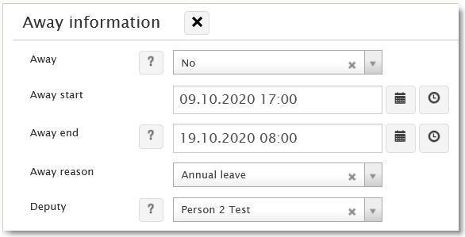

# Absence setting for person with ESS deputy sync

**Källa:** https://community.efecte.com/t/p8h6f0v/absence-setting-for-person-with-ess-deputy-sync
**Publicerad:** 2020-09-28T12:54:27.453Z
**Uppdaterad:** 2023-06-15T12:40:20.063000
**Författare:** 

---

Absence setting for person with ESS deputy sync

      
    
          
      

        
              Antti AholaEfecte Employee
            

            Principal Technical Lead
              Antti_Ahola
            updated 2 yrs agoThu, June 15, 2023 at 12:40 PM GMT+2
  

          2replies
        Antti AholaEfecte Employee1 yr agoWed, September 18, 2024 at 4:55 PM GMT+2
  
         Normal ★★
        

        
    

      
          

    
        
        
        
      

    

  
  
    Away setting for person
  
  
  
    Implementation instructions - Absence setting for person with ESS deputy sync
  
  
  
    person_absence_listenerset.xml
  
  
  
    person_absence_update_supportgroups.xml
  
  
  
    absence_import.xml
  
  
  
    ESS_deputies_with_delegation_period.py
  
  
   This is the 2.0 version of previous "Away setting for person", which didn't include the ESS deputy sync. The old version is also still included here as a  single separate ZIP file. Other 5 files contain the necessary configurations and instructions for this new version of the feature. This new version requires new EPE/ESM based organization data connector for ESS (on the contrary to EIM based organization data connector), when you want to use the ESS deputy sync!  
 This add-on feature enables setting persons to be "absent" for certain period of time now or in the future, with possibility to include a reason and select a deputy person to handle unresolved tickets.  Automation sets Absence=Yes on "Absence start" and Absence=No on "Absence end" datetimes accordingly. Instructions provided on how to filter people who are away from being selected for ticket assignment and feature also allows possibility to use this as criteria to limit emailing for these people. Optional automation for automatic reassigning of open tickets to deputy person, assuming they are members of the same support group the ticket belongs to, is also provided.  
 
 In ESS, you are able to insert more than one deputy, although in ESM you can only define and adjust one (current/latest). When you have multiple deputies and the current one goes into past, this logic also updates the listing conveniently to both applications. 
 Also possible to add a newer deputization via ESM, although there would be later deputees defined via ESS, as well as possible to update the current/latest deputization timeframe via ESM 
 When ESM side automation removes a deputy from the ESS deputies with delegation period attribute, which stores the ESS deputization data, you need to consider there might be a delay before ESS side gets updated via the polling of the organization data connector.  
 Automatically adjusts conflicting days for overlapping deputizations, in case someone sets previous and next deputization to end and start on the same day in ESS. Takes into consideration only same day conflict, so that the latter then gets separated to next day (start moved one day forward). Nobody should set an overlapping conflict to cover multiple days, although this might be possible! 
 This includes now also automatically support for both international (yyyy-MM-DD mm:ss) and Finnish (DD.MM.yyyy mm:ss) timestamp when configured as ESM datetime output, so it can insert ESS deputy dates reading from those formats in Absence start / end attributes. 

          
    
        Templates
      
    
        Administration
      
    
        Service Management Tool
      
    
  
  Vote
  Follow
    
            10

## Bilder

