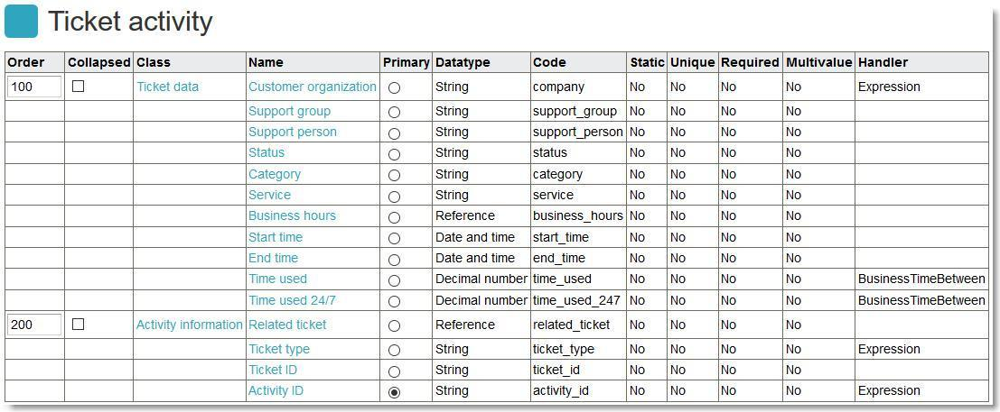
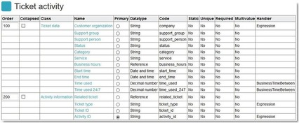
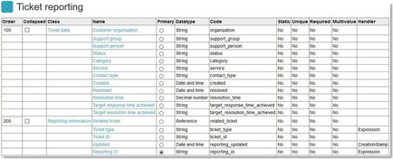

# Activity / reporting for multi ticket templates

**Källa:** https://community.efecte.com/t/x2ht32a/activity-reporting-for-multi-ticket-templates
**Publicerad:** 2020-12-14T17:33:41.010Z
**Uppdaterad:** 2020-12-14T18:33:41.010000
**Författare:** 

---

Activity / reporting for multi ticket templates

      
    
          
      

        
              Antti AholaEfecte Employee
            

            Principal Technical Lead
              Antti_Ahola
            5 yrs agoMon, December 14, 2020 at 6:33 PM GMT+1
  

           Normal ★★
        

        
    

      
          

    
        
        
        
      

     
          
          

  

  
  
    Implementation instructions - Ticket activity reporting
  
  
  
    ticket_activity_listenerset_chg.xml
  
  
  
    ticket_activity_listenerset_inc.xml
  
  
  
    ticket_activity_listenerset_schg.xml
  
  
  
    ticket_activity_listenerset_sr.xml
  
  
  
    ticket_activity_template.xml
  
  
  
    ticket_reporting_listenerset_chg.xml
  
  
  
    ticket_reporting_listenerset_inc.xml
  
  
  
    ticket_reporting_listenerset_schg.xml
  
  
  
    ticket_reporting_listenerset_sr.xml
  
  
  
    ticket_reporting_template.xml
  
  
   This add-on includes activity / combined reporting data recording for Incident, Service request, Change and Standard change templates to be combined into one reporting datacard template Ticket activity or Ticket reporting. Also any other template could similarly be included with appropriate customization.  
 Activity style (heavy data creation). Initiating the creation of this activity data by implementing this feature will result in plenty of activity datacards. The feature observes the changes in Support group (or Assigned to), Support person (or Change manager), Status, Category and Service attributes and any change in any of these attributes on any of the implemented templates will create a new activity datacard. As a result, there will exist several activity datacards per each actual ticket, which can be used to construct reporting based on attribute value changes and the timespans when the attributes had certain value(s). Depending on the ticket amounts handled, there could be performance impact in the long run. With huge amounts of reporting data being produced, it is recommended to consider automatic deletion of older activity data, such as older than previous year, for example.  
 Combined template reporting style (light data creation). Initiating the creation of this activity data by implementing this feature will result in a single activity/reporting datacard per actual ticket. The feature observes the changes in Support group (or Assigned to), Support person (or Change manager), Status, Category and Service attributes and any change in any of these attributes on any of the implemented templates will update the existing activity datacard so, that after resolving/closing the ticket, activity card maintains those values at that point of the handling. With this style, you are able to set up a simpler combined dataset to build reports rather based on actual amounts of tickets of certain customers, which group or person resolved them and what were the categorizations, but with limited value for time based reporting capability. 
          
    
        Reporting
      
    
        IT Service Management
      
    
        Templates
      
    
  
  Vote
  Follow
    
            2

## Bilder

