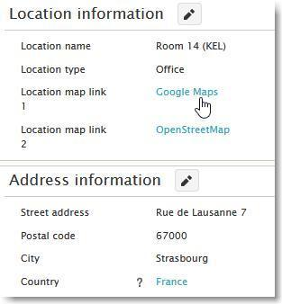
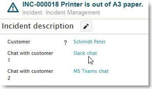

# External linking examples

**Källa:** https://community.efecte.com/t/h7hk8g7/external-linking-examples
**Publicerad:** 2021-06-14T14:32:54.840Z
**Uppdaterad:** 2021-06-14T16:32:54.840000
**Författare:** 

---

External linking examples

      
    
          
      

        
              Antti AholaEfecte Employee
            

            Principal Technical Lead
              Antti_Ahola
            4 yrs agoMon, June 14, 2021 at 4:32 PM GMT+2
  

           Easy ★
        

        
    

      
          

    
        
        
        
      

     
          
          

  

  
  
    Implementation instructions - External linking
  
  
   This document describes the necessary steps for implementing a few popular use cases of external sites or applications linking into ESM that can provide additional usability and allow faster direct access to data and functionalities outside Efecte application. Examples shown relate to maps, chat and visually shortening links. Similarly, several other use cases could be applied as well, these providing the example idea for the usage. 
          
    
        Service Management Tool
      
    
        Administration
      
    
  
  Vote
  Follow
    
            1

## Bilder

