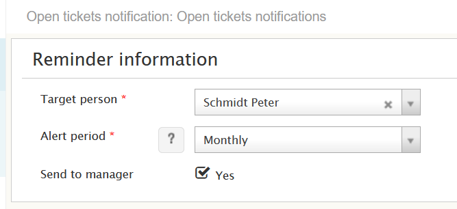
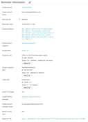

# Mass notification of open tickets

**Källa:** https://community.efecte.com/t/35h6f0l/mass-notification-of-open-tickets
**Publicerad:** 2020-09-28T12:06:37.330Z
**Uppdaterad:** 2020-09-28T19:02:38.710000
**Författare:** 

---

Mass notification of open tickets

      
    
          
      

        
              Henry Kemppi
            

            
              Henry_Kemppi
            updated 5 yrs agoMon, September 28, 2020 at 7:02 PM GMT+2
  

           Normal ★★
        

        
    

      
          

    
        
        
        
      

     
          
          

  

  
  
    open_tickets_notification.xml
  
  
  
    Mass notification of open tickets
  
  
   This add-on feature sends automatic emails to ESM users on open tickets weekly or monthly (user can select). A single cumulative email with listing of all open tickets, instead of one email per ticket. By default the incidents, service requests and tasks are built-in. 
          
    
        Administration
      
    
        Templates
      
    
        Service Management Tool
      
    
  
  Vote
  Follow
    
            4

## Bilder

