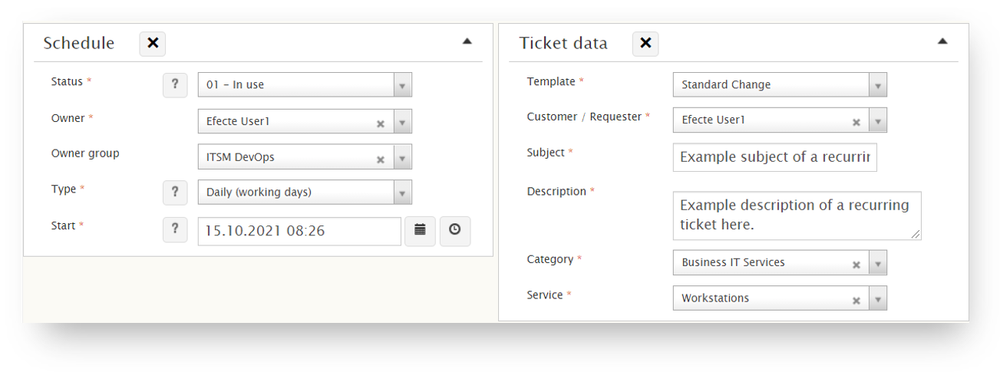

# Recurring ticket feature

**Källa:** https://community.efecte.com/t/p8hgxtj/recurring-ticket-feature
**Publicerad:** 2021-10-12T05:32:42.583Z
**Uppdaterad:** 2021-10-12T07:32:42.583000
**Författare:** 

---

Recurring ticket feature

      
    
          
      

        
              Jukka-Pekka SalminenEfecte Employee
            

            Senior Architect
              JukkaPekka_Salminen
            4 yrs agoTue, October 12, 2021 at 7:32 AM GMT+2
  

           Hard ★★★
        

        
    

      
          

    
        
        
        
      

    

  
  
    Implementation instructions - Recurring ticket
  
  
  
    recurring_tickets_listeners.xml
  
  
  
    recurring_tickets_template.xml
  
  
   This add-on feature enables you to create recurring tickets based on a predefined values and customised schedules. This feature is currently configured to create Incidents and Standard Changes, but can be extended to work with any template if needed, which requires minor changes to existing configuration; adding of a static value, creation of a new transformation and a new transformation listener. Currently supported schedule types can also be extended if needed, but this requires adding a new static value and a bit more complex scripting of the calculation expression.  
 Featured schedule types:  
 
 Daily 
 Daily (working days) 
 Every x months 
 Every x weeks 
 
 Files included:  
 
 Implementation instructions - Recurring ticket.pdf 
 recurring_tickets_template.xml 
 recurring_tickets_listeners.xml 

          
    
        Templates
      
    
        Administration
      
    
        Service Management Tool
      
    
  
  Vote
  Follow
    
            7

## Bilder

