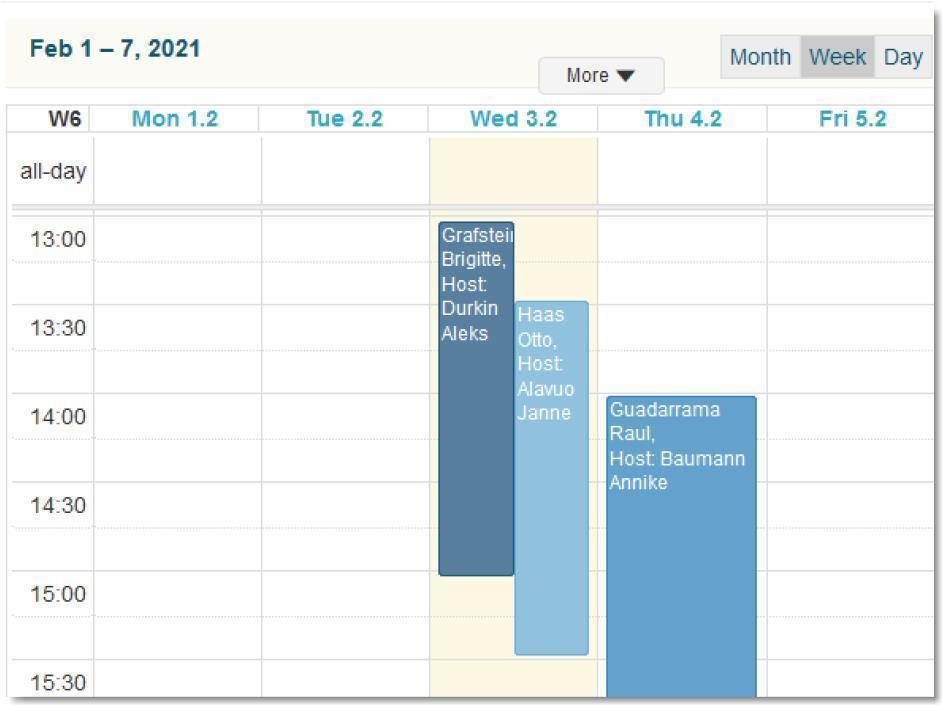

# Visitor management

**Källa:** https://community.efecte.com/t/g9hlb6r/visitor-management
**Publicerad:** 2021-03-29T08:09:58.110Z
**Uppdaterad:** 2021-03-29T10:09:58.110000
**Författare:** 

---

Visitor management

      
    
          
      

        
              Antti AholaEfecte Employee
            

            Principal Technical Lead
              Antti_Ahola
            4 yrs agoMon, March 29, 2021 at 10:09 AM GMT+2
  

           Easy ★
        

        
    

      
          

    
        
        
        
      

    

  
  
    Implementation instructions - Visitor management
  
  
  
    visitor_management_import.xml
  
  
   This feature is for lobby personnel on managing visitors at company premises. Includes:  
 
 Host info, visitor info, arrival datetime, duration, arrival/no show buttons 
 Additionally car registration number for parking purposes and email notification for host on visitor arrival 
 Reports: upcoming visitors, calendar view, amounts of visitors in a timeframe 
 
 Lobby personnel are able to register visitor arrivals with a button that would notify the host via email, but also a list view showing phone number of host to call.  
 There is possibility to extend functionality with a calendar invite towards O365, using Efecte Integration Service, as a billable consulting task. Also, if there would be an SMS gateway in use, the notifications could be pushed as text messages there for the host person to receive. 
          
    
        Service Management Tool
      
    
        Administration
      
    
        Templates
      
    
  
  Vote
  Follow

## Bilder

