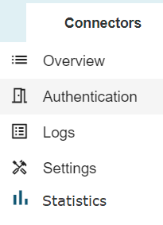

# EPE provisioning Statistics view for Admin Users

**Källa:** https://community.efecte.com/t/83yt23b/epe-provisioning-statistics-view-for-admin-users
**Publicerad:** 2024-09-05T06:15:12.343Z
**Uppdaterad:** 2024-09-05T08:15:12.343000
**Författare:** 

---

EPE provisioning Statistics view for Admin Users

      
    
          
      

        
              Tuija Länsisalmi
            

            
              Tuija_Lansisalmi
            1 yr agoThu, September 5, 2024 at 8:15 AM GMT+2
  

          

        
    

      
          

    
        
        
        
      

    

  Problem statement 
Customers are seeking a user-friendly way to view their monthly provisioning statistics for Efecte solutions. Currently, this information is only accessible through logs, making it difficult for users to track and analyze their provisioning activity effectively.
 
Short description
We are introducing an enhancement to EPE statistics handling. Admin can see the provisioning amounts in graphic form. 
 
Use case details
Admin can see the provisioning amounts from the connector page in ESM. Own tab in connector page called Statistics. Displays weekly provisionings in graphic form. Display monthly provisonings in graphic form.
          
    
        EPE
      
    
  
  Vote
  Follow

## Bilder

