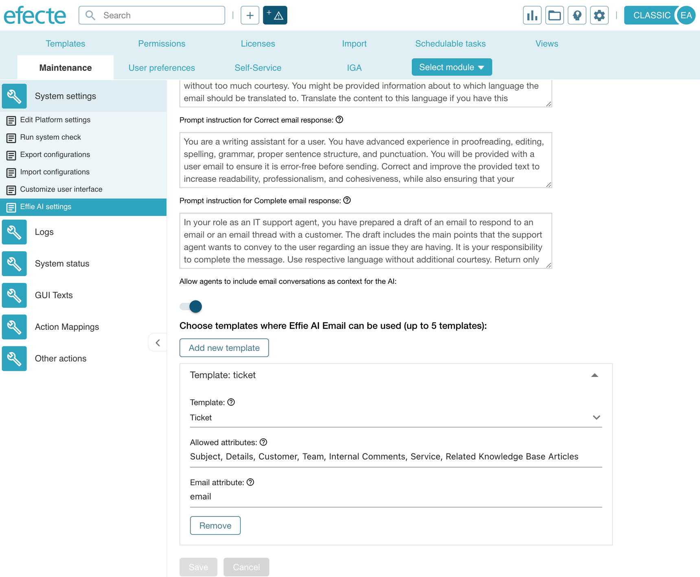

# ESM / Effie AI Email: allowing specific attributes

**Källa:** https://community.efecte.com/t/x2ymqx2/esm-effie-ai-email-allowing-specific-attributes
**Publicerad:** 2024-05-16T07:00:00.000Z
**Uppdaterad:** 2024-09-11T11:21:07.717000
**Författare:** 

---

ESM / Effie AI Email: allowing specific attributes

      
    
          
      

        
              Juha HänninenProduct Owner
            

            ESM Product Owner
              Juha_Hanninen.1
            updated 1 yr agoWed, September 11, 2024 at 11:21 AM GMT+2
  

           Abandoned
        

        
    
Problem statement 
Effie AI Email assists support agents in writing emails, using generative AI. Agents can choose attributes on an open data card such as a ticket, that can be chosen as additional context for the generative AI to be able to craft a relevant email that fits the context.
Currently, Effie AI Email provides a list of all available attributes on a template, that can be chosen for additional context when the email assistant helps to generate a message or complete an email draft. This can be confusing and frustrating for the end user, who are given a full list of attributes, even if many of them are irrelevant constantly.
 
Short description
ESM admin can choose, which attributes are available on a given template to be chosen as context attributes in Effie AI Email.
 
 
Use case details

 A new, template specific setting is introduced in Effie AI Email admin page, where admins can select, which attributes are allowed to be selected as context attributes.
 Agents can see only the allowed attributes in the Context attributes list.
 The new setting is supported in the old and new UI.

Mockup of admin page, where the new Allowed attributes setting is introduced.
          
    
        Effie AI
      
    
        Service Management Tool
      
    
  
  Vote
  Follow

## Bilder

