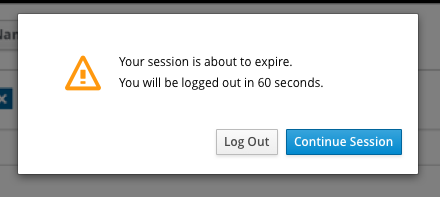

# Notify users in ESA environment that their current session is about to expire

**Källa:** https://community.efecte.com/t/35yxbfs/notify-users-in-esa-environment-that-their-current-session-is-about-to-expire
**Publicerad:** 2024-02-14T06:51:48.167Z
**Uppdaterad:** 2024-02-14T07:51:48.167000
**Författare:** 

---

Notify users in ESA environment that their current session is about to expire

      
    
          
      

        
              Tuija Länsisalmi
            

            
              Tuija_Lansisalmi
            1 yr agoWed, February 14, 2024 at 7:51 AM GMT+1
  

          

        
    

      
          

    
        
        
        
      

    

  Problem statement 
ESA ensures that user sessions are terminated when a configured timeout is reached, sometimes this leads to data lost if user has not saved the changes. 
 
Short description
We are introducing an enhancement to ESA session handling. ESA will notify users in ESM environment that their current session is about to expire in certain amount of time (e.g. 60 seconds)? 
 
Use case details
Popup window is displayed that tells to the end user that session is about to expire. User can Log out or continue session. Popup is optional and admin can define is it in use or not.
          
    
        ESA
      
    
  
  Vote
  Follow
    
            4

## Bilder

