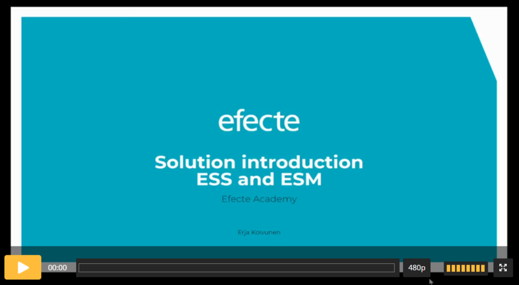

# Solution introduction - Service Management

**Källa:** https://community.efecte.com/t/x2hvd0j/solution-introduction-service-management
**Publicerad:** 2023-08-16T10:19:45.370Z
**Uppdaterad:** 2023-08-16T12:59:33.773000
**Författare:** 

---

Solution introduction - Service Management

      
    

        updated 2 yrs agoWed, August 16, 2023 at 12:59 PM GMT+2
  
          

        
    
 Introduction videos are targeted to those who will take part in Efecte implementation project and/or will become Efecte administrators. Or to anyone who wants to get familiar with Efecte Service Management Solution.  
 Objective of the Solution introduction video is to describe the Efecte baseline solution, which will help to facilitate implementation workshops, and solution testing. Administrator's tasks videos act as an orientation to administrators.  
  
   
 Click the link above and you can watch any or all 3 introduction videos:  
 
 Solution introduction video - Length: 38:22  
 ESS Administrator's tasks video - Length: 7:02 
 ESM Administrator's tasks video - Length: 5:59 

          
    
        Administration
      
    
        IT Service Management
      
    
        Self-Service Portal
      
    
  
  Like
  Follow
    
            2

## Bilder

