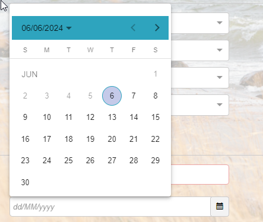

# Known Bug in Calendar Picker Functionality on Efecte’s Self-Service Portal release 2024.1

**Källa:** https://community.efecte.com/t/m1ym1p8/known-bug-in-calendar-picker-functionality-on-efectes-self-service-portal-release-2024-1
**Publicerad:** 2024-06-07T08:05:55.940Z
**Uppdaterad:** 2024-06-07T10:09:50.533000
**Författare:** 

---

Known Bug in Calendar Picker Functionality on Efecte’s Self-Service Portal release 2024.1

      
    
          
      

        
              Aki YlivarviModerator
            

            
              Aki_Ylivarvi
            updated 1 yr agoFri, June 7, 2024 at 10:09 AM GMT+2
  

          

        
    

      
          

    
        
        
        
      

    

  In the latest release, 2024.1, the calendar picker incorrectly displays Sunday as the first day of the week instead of Monday.
 
We understand that this may cause some confusion or inconvenience, and we sincerely apologize for any disruption this may have caused. Our development team is aware of this issue and will make a fix for the next release. In the meantime, we ask for your patience and understanding.
 
If you have any questions or concerns, please do not hesitate to contact our Service Desk.
 
Best regards, 
Aki Ylivarvi, Product Manager of Efecte's Self-Service products
          
    
        Self-Service Portal
      
    
        Known Error
      
    
  
  Vote
  Follow

## Bilder

